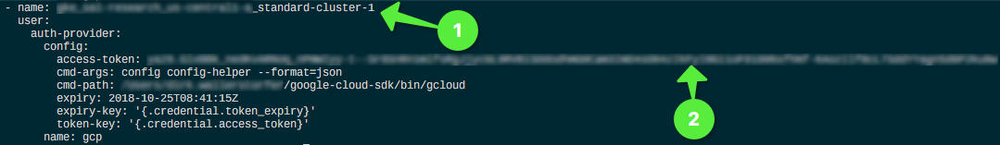
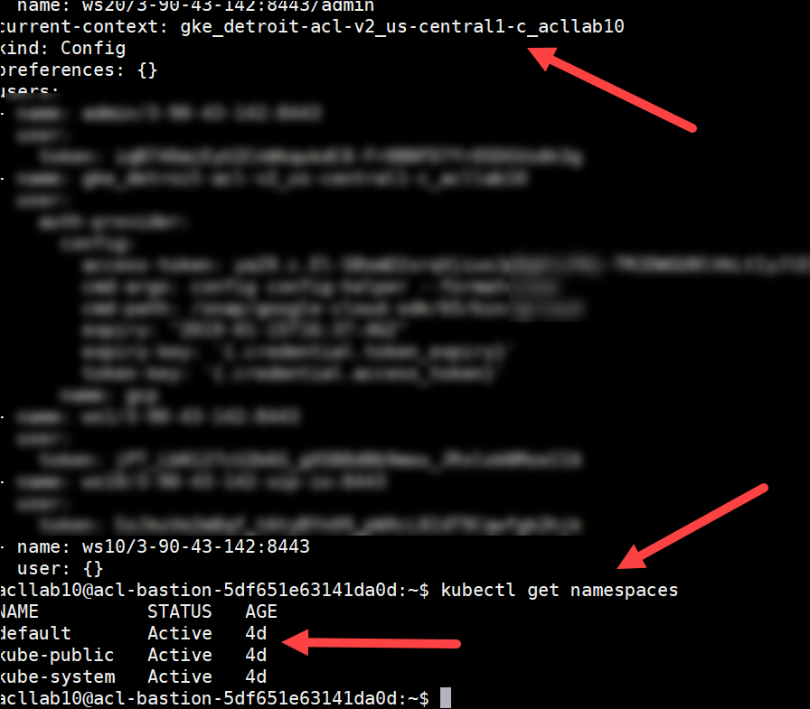
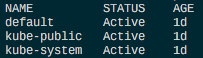

# Check Prerequisites

## Data needed

* Access to the bastion host.
* Access to the Dynatrace Tenant provided for the lab.
Note: Dynatrace Tenant should preferably be on Sprint or Production environments as certain functionality like tagging and custom properties can be unstable/limited on DEV Tenants.

## Verifying the bastion

1. If you haven't received your user credentials and connection information for the bastion host, please reach out to one of the instructors.

1. Use your ssh client to connect to the bastion host and ensure the ```kubectl``` is configured for your GKE cluster.

    ```bash
    (local)$ ssh <username>@<bastion-ip>
    ```

    When asked, please provide the password and you should be connected to a terminal at the bastion host.

1. Check the `kubectl` configuration

    ```bash
    (bastion)$ kubectl config view
    ```

    The output should look similiar to the following image, where (1) should be the name of your cluster, and (2) is the generated access token.

    

    Also, be sure the current context is set to the gcloud cluster. It should look as follows.

    

    If not, execute the following for your cluster:

    ```bash
    kubectl config use-context <your-gke-cluster-name>
    ```

    ```bash
    (bastion)$ kubectl get namespaces
    ```

    The output should look similiar to the following image.

    

## Gather information

The next steps will require us to gather information 

---

:arrow_forward: [Next Step: Gathering Facts and installing the OneAgent Operator](../1_Facts_and_OneAgent)

:arrow_up_small: [Back to overview](../)
