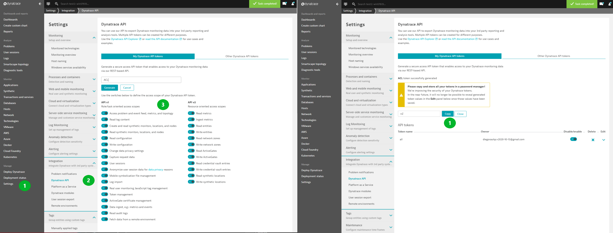

# Generating a Dynatrace API Token

## Data needed
* Access to the Dynatrace tenant that you have signed up for as part of this ACL or the one provided to you by your instructor

## Steps

For the Autonomous Cloud lab, we need to generate a Dynatrace API token.

The name of the token is not important, a good suggestion would be ```ACL```

For lab purposes we are going to grant access to all the scope for API v1 and API v2 (this is not a recommended approach for production environments)

To generate a token in your Dynatrace tenant, go to Settings -> Integration -> Dynatrace API.



More information on how to generate a token, can be found in the  [Dynatrace documentation](https://www.dynatrace.com/support/help/extend-dynatrace/dynatrace-api/basics/dynatrace-api-authentication/#generate-a-token).

---

:arrow_up_small: [Back to overview](README.md)