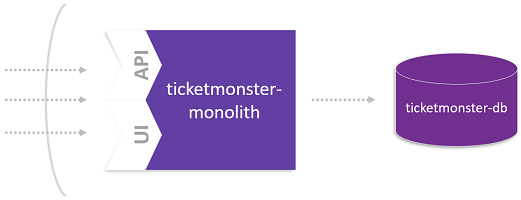
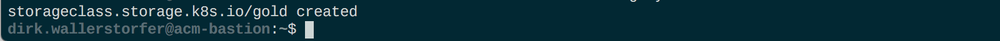
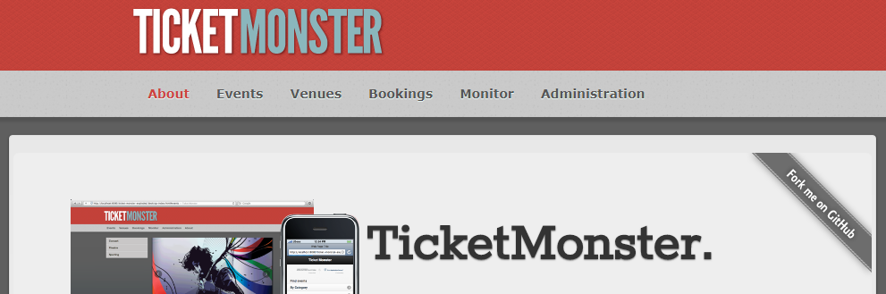

# Lift-and-Shift TicketMonster to a Cloud Platform

In this lab you'll learn how to move a monolithic application to a cloud platform, Kubernetes in this case. The applied moving approach follows a lift-and-shift concept. This means that the application is not prepared as a cloud-native application. However, the database for the application will be a service that runs on Kubernetes. 



## Step 1: Create a namespace for Ticketmonster

1. Provision the storage class that will be used during the ACL by executing the following command (~/manifests-env-zero/k8s-storage.yml):
    ```
    (bastion)$ kubectl create -f manifests-env-zero/k8s-storage.yml
    ```

    Expected output:

    

1. Create a namespace for ticketmonster
    ```
    (bastion) $ kubectl create ns ticketmonster
    ```

1. Verify the namespace has been created
    ```
    (bastion) $ kubectl get ns
    NAME            STATUS   AGE
    default         Active   1d
    kube-public     Active   1d
    kube-system     Active   1d
    ticketmonster   Active   7s
    ```

## Step 2: Create Database for Monolith

1. Deploy a MySQL database service.
    Checkout the `manifests-ticketmonster/ticket-db.yml` file that will be used to create the database.
    <details>
        <summary>ticket-db.yml</summary>

        ---
        apiVersion: v1
        kind: PersistentVolumeClaim
        metadata:
        name: ticketmonster-db-mysqldata
        namespace: ticketmonster
        spec:
        accessModes:
        - ReadWriteOnce
        resources:
            requests:
            storage: 10Gi
        storageClassName: gold
        ---
        apiVersion: extensions/v1beta1
        kind: Deployment
        metadata:
        name: ticketmonster-db
        namespace: ticketmonster
        spec:
        replicas: 1
        strategy:
            type: Recreate
        template:
            metadata:
            labels:
                name: ticketmonster-db
            spec:
            containers:
            - image: mysql:5.5
                name: ticketmonster-db
                env:
                - name: MYSQL_USER
                value: ticket
                - name: MYSQL_PASSWORD
                value: monster
                - name: MYSQL_DATABASE
                value: ticketmonster
                - name: MYSQL_ROOT_PASSWORD
                value: Dynatrace123!
                ports:
                - containerPort: 3306
                volumeMounts:
                - mountPath: /var/lib/mysql
                name: ticketmonster-db-mysqldata
            restartPolicy: Always
            volumes:
            - name: ticketmonster-db-mysqldata
                persistentVolumeClaim:
                claimName: ticketmonster-db-mysqldata
        ---
        apiVersion: v1
        kind: Service
        metadata:
        name: ticketmonster-db
        namespace: ticketmonster
        spec:
        ports:
            - port: 3306
        selector:
            name: ticketmonster-db
        ---
        
    </details>

    ```
    (bastion) $ kubectl create -f manifests-ticketmonster/ticket-db.yml

    persistentvolumeclaim/ticketmonster-db-mysqldata created
    deployment.apps/ticketmonster-db created
    service/ticketmonster-db created
    ```

1. Checkout the artifacts created.
    ```
    (bastion) $ kubectl -n ticketmonster get all
    NAME                                    READY   STATUS    RESTARTS   AGE
    pod/ticketmonster-db-6bd844cc57-5tvfg   1/1     Running   0          59s

    NAME                       TYPE        CLUSTER-IP    EXTERNAL-IP   PORT(S)    AGE
    service/ticketmonster-db   ClusterIP   10.90.10.20   <none>        3306/TCP   59s

    NAME                               DESIRED   CURRENT   UP-TO-DATE   AVAILABLE   AGE
    deployment.apps/ticketmonster-db   1         1         1            1           59s

    NAME                                          DESIRED   CURRENT   READY   AGE
    replicaset.apps/ticketmonster-db-6bd844cc57   1         1         1       59s
    ```

## Step 3: Deploy TicketMonster

1. Deploy the Ticketmonster monolith application
    Checkout the `manifests-ticketmonster/ticket-monolith.yml` file that will be used to create the database.
    <details>
        <summary>ticket-monolith.yml</summary>

        ---
        apiVersion: extensions/v1beta1
        kind: Deployment
        metadata:
        name: ticketmonster-monolith
        namespace: ticketmonster
        spec:
        replicas: 1
        template:
            metadata:
            labels:
                app: ticketmonster-monolith
                version: v1
            spec:
            containers:
            - name: ticketmonster-monolith
                image: dynatraceacm/ticketmonster-monolith:latest
                env:
                - name: MYSQL_SERVICE_HOST
                value: ticketmonster-db
                - name: MYSQL_SERVICE_PORT
                value: "3306"
                resources:
                limits:
                    cpu: 500m
                    memory: 1024Mi
                requests:
                    cpu: 400m
                    memory: 768Mi
                ports:
                - containerPort: 8080
                livenessProbe:
                httpGet:
                    path: /
                    port: 8080
                initialDelaySeconds: 60
                periodSeconds: 10
                timeoutSeconds: 15
                readinessProbe:
                httpGet:
                    path: /
                    port: 8080
                initialDelaySeconds: 60
                periodSeconds: 10
                timeoutSeconds: 15
            nodeSelector:
                beta.kubernetes.io/os: linux
        ---
        apiVersion: v1
        kind: Service
        metadata:
        name: ticketmonster-monolith
        labels:
            app: ticketmonster-monolith
        namespace: ticketmonster
        spec:
        ports:
        - name: http
            port: 80
            targetPort: 8080
        selector:
            app: ticketmonster-monolith
        type: LoadBalancer
        ---
    </details>

    ```
    (bastion) $ kubectl create -f manifests-ticketmonster/ticket-monolith.yml

    deployment.apps/ticketmonster-monolith created
    service/ticketmonster-monolith created
    ```

## Step 4: Test your TicketMonster

1. Get the public endpoint of your ticketmonster application.
    ```
    (bastion) $ kubectl get svc ticketmonster-monolith -n ticketmonster

    NAME                     TYPE           CLUSTER-IP    EXTERNAL-IP      PORT(S)        AGE
    ticketmonster-monolith   LoadBalancer   10.90.1.223   xxx.xxx.xxx.xxx   80:30371/TCP   9m53s
    ```

1. Open the route using a browser and navigate through the application.



---

[Previous Step: Gathering Facts and installing the OneAgent Operator](../1_Facts_and_OneAgent) :arrow_backward: :arrow_forward: [Next Step: Extract UI From Monolith](../3_Extract_UI_From_Monolith)

:arrow_up_small: [Back to overview](../)
