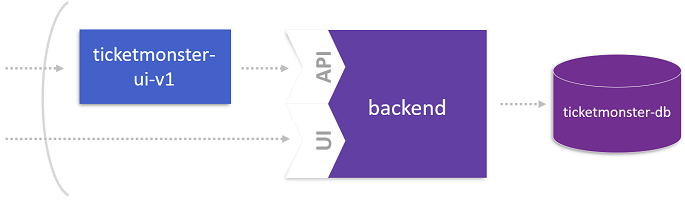
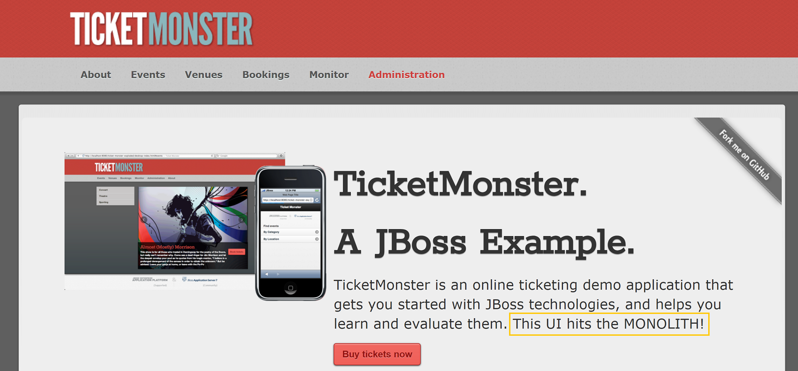

# Extract the User Interface from the Monolith

To start breaking up the monolith, a best practice is extracting the user interface from TicketMonster since this helps to decouple the client facing part from the business logic. So, this lab launches the first microservice to seperate the user interface from the rest of TicketMonster as depicted below.



## Step 1: Deploy TicketMonster UI

1. Deploy the Ticketmonster UI microservice

    Checkout the `manifests-ticketmonster/ticket-ui.yml` file. It will be used to create a new front end for TicketMonster that talks to the backend.
    <details>
        <summary>ticket-ui.yml</summary>

        ---
        apiVersion: extensions/v1beta1
        kind: Deployment
        metadata:
        name: ticketmonster-ui
        namespace: ticketmonster
        spec:
        replicas: 1
        template:
            metadata:
            labels:
                app: ticketmonster-ui
                version: v1
            spec:
            containers:
            - name: ticketmonster-ui
                image: dynatraceacm/ticketmonster-ui-v1:latest
                env:
                - name: BACKENDURL
                value: ticketmonster-monolith
                resources:
                limits:
                    cpu: 500m
                    memory: 1024Mi
                requests:
                    cpu: 400m
                    memory: 768Mi
                ports:
                - containerPort: 8080
                livenessProbe:
                httpGet:
                    path: /
                    port: 8080
                initialDelaySeconds: 30
                periodSeconds: 10
                timeoutSeconds: 15
                readinessProbe:
                httpGet:
                    path: /
                    port: 8080
                initialDelaySeconds: 30
                periodSeconds: 10
                timeoutSeconds: 15
            nodeSelector:
                beta.kubernetes.io/os: linux
        ---
        apiVersion: v1
        kind: Service
        metadata:
        name: ticketmonster-ui
        labels:
            app: ticketmonster-ui
        namespace: ticketmonster
        spec:
        ports:
        - name: http
            port: 80
            targetPort: 8080
        selector:
            app: ticketmonster-ui
        type: LoadBalancer
        ---
    </details>

    Apply the yaml file to create the service

    ```bash
    (bastion) $ kubectl apply -f manifests-ticketmonster/ticket-ui.yml
    
    deployment.apps/ticketmonster-ui created
    service/ticketmonster-ui created
    ```

## Step 2: Test UI that hits the Monolith

1. Get the public endpoint of the user interface **ticketmonster-ui**.

    ```bash
    (bastion) $ kubectl -n ticketmonster get service/ticketmonster-ui
    NAME               TYPE           CLUSTER-IP     EXTERNAL-IP       PORT(S)        AGE
    ticketmonster-ui   LoadBalancer   10.90.11.110   xxx.xxx.xxx.xxx   80:31621/TCP   63s
    ```

1. Open the route using a browser. Can you read **This UI hits the Monolith** on the start page? If yes, you are now using TicketMonster via the decoupled user interface. If you do not see this message, ask an instructor for assistance.



---

[Previous Step: Lift and Shift TicketMonster](../2_Lift-and-Shift_TicketMonster) :arrow_backward: :arrow_forward: [Next Step: Generate Load on UI](../4_Generate_Load_on_UI)

:arrow_up_small: [Back to overview](../)
