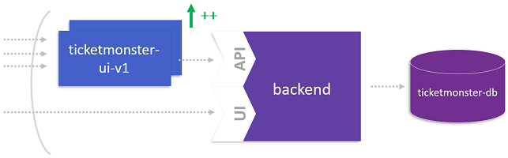
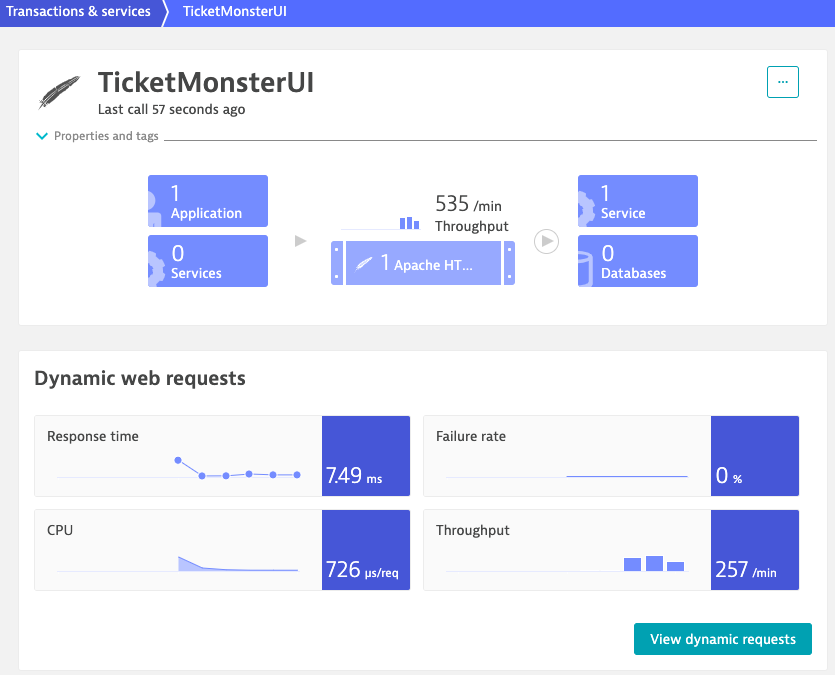

# Generate Load on the New UI

This lab runs a load generation script for TicketMonster. The script simulates real user actions by utilizing the [PhantomJS](http://phantomjs.org/download.html) and [CasperJS](http://casperjs.org/) framework. While PhantomJS is a headless web browser scriptable with JavaScript, CasperJS allows you to build full navigation scenarios.



## Step 1. Run container and start script

1. Usage of load generation script:

    ```bash
    usage: loadgeneration.sh <target URL> <duration in minutes> <[clients/minute] | [empty = random number of clients (1..10) / minute] >
    ```

1. Start script using the container.

    ```bash
    (bastion) $ docker run -d --name $USER dynatraceacm/ticketmonster-load-generator /bin/bash loadgeneration.sh http://$(kubectl get svc ticketmonster-ui -n ticketmonster -o json | jq -r .status.loadBalancer.ingress[].ip) 60 15
    ```

1. Verify the container is running

    ```bash
    (bastion) $ docker ps --all
    CONTAINER ID        IMAGE                                       COMMAND                  CREATED             STATUS              PORTS               NAMES
    217f216fcab9        dynatraceacm/ticketmonster-load-generator   "/bin/bash loadgener…"   31 seconds ago      Up 30 seconds                           acluser#
    ```

1. View the load increase in Dynatrace



---

[Previous Step: Extract UI From Monolith](../3_Extract_UI_From_Monolith) :arrow_backward: :arrow_forward: [Next Step: Identify a Microservice](../5_Identify_a_Microservice)

:arrow_up_small: [Back to overview](../)
