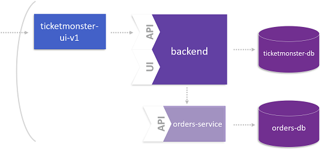
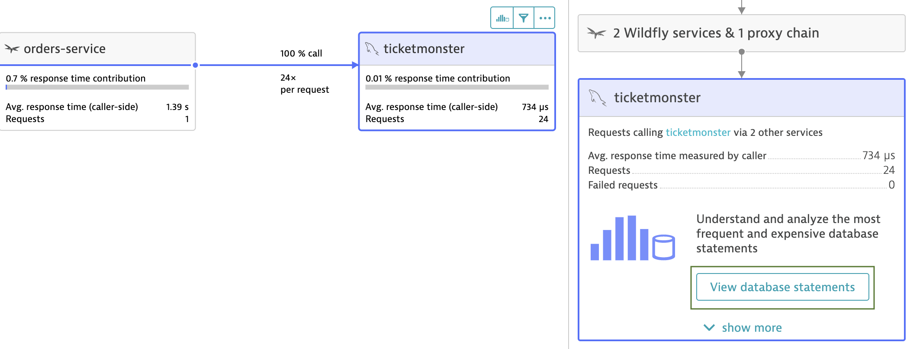

# The Microservice and its Domain Model

This lab is dedicated to the data management of the microservice we identified in the previous step. The overall goal is that the microservice consumes legacy data from the monolith but persists new data in its own database.

For more details about this lab, please take a look at the following blog post: [Identifying its Domain Model](https://www.dynatrace.com/news/blog/monolith-to-microservices-the-microservice-and-its-domain-model/).



## Step 1: Use Dynatrace to learn more about the Domain Model

1. Open service flow as explained in **Lab 4 - Identify a Microservice** at **Step 3**.
1. Follow the service flow through BookingService and the orders-service.
1. Click on the MySQL instance **ticketmonster** and on **View database statements**.


## Step 2: Create database for microservice

1. Create the database for the microservice.
    
    Checkout the `manifests-ticketmonster/ticket-ordersdb.yml` file. It will be used to create a new database and a schema for the new orders service.
    <details>
        <summary>ticket-ordersdb.yml</summary>

        ---
        apiVersion: v1
        kind: PersistentVolumeClaim
        metadata:
        name: ticketmonster-ordersdb-mysqldata
        namespace: ticketmonster
        spec:
        accessModes:
        - ReadWriteOnce
        resources:
            requests:
            storage: 10Gi
        storageClassName: gold
        ---
        apiVersion: extensions/v1beta1
        kind: Deployment
        metadata:
        name: orders-db
        namespace: ticketmonster
        spec:
        replicas: 1
        template:
            metadata:
            labels:
                name: orders-db
            spec:
            containers:
                - name: orders-db
                image: mysql:5.5
                imagePullPolicy: "IfNotPresent"
                env:
                    - name: MYSQL_USER
                    value: ticket
                    - name: MYSQL_PASSWORD
                    value: monster
                    - name: MYSQL_DATABASE
                    value: orders
                    - name: MYSQL_ROOT_PASSWORD
                    value: Dynatrace123!
                ports:
                    - containerPort: 3306
                volumeMounts:
                    - mountPath: /docker-entrypoint-initdb.d
                    name: mysql-initdb
                    - mountPath: /var/lib/mysql
                    name: ticketmonster-ordersdb-mysqldata
            volumes:
                - name: mysql-initdb
                configMap:
                    name: mysql-initdb-config
                - name: ticketmonster-ordersdb-mysqldata
                persistentVolumeClaim:
                    claimName: ticketmonster-ordersdb-mysqldata
        ---
        apiVersion: v1
        kind: Service
        metadata:
        name: orders-db
        namespace: ticketmonster
        spec:
        ports:
            - port: 3306
        selector:
            name: orders-db
        ---
        apiVersion: v1
        kind: ConfigMap
        metadata:
        name: mysql-initdb-config
        namespace: ticketmonster
        data:
        initdb.sql: |
            CREATE TABLE `section` (
            `id` bigint(20) NOT NULL AUTO_INCREMENT,
            `description` varchar(255) NOT NULL,
            `name` varchar(255) NOT NULL,
            `number_of_rows` int(11) NOT NULL,
            `row_capacity` int(11) NOT NULL,
            `venue_id` bigint(20) DEFAULT NULL,
            `venue_name` varchar(255) DEFAULT NULL,
            PRIMARY KEY (`id`),
            UNIQUE KEY `UKbdpgnn9f25eootvop4cqics0i` (`name`,`venue_id`)
            ) ;
            CREATE TABLE `appearance` (
            `id` bigint(20) NOT NULL AUTO_INCREMENT,
            `event_id` bigint(20) DEFAULT NULL,
            `event_name` varchar(255) DEFAULT NULL,
            `venue_id` bigint(20) DEFAULT NULL,
            `venue_name` varchar(255) DEFAULT NULL,
            PRIMARY KEY (`id`),
            UNIQUE KEY `UKfgr2nkyi0qpjhjvji0mdfvudc` (`event_id`,`venue_id`)
            ) ;
            CREATE TABLE `booking` (
            `id` bigint(20) NOT NULL AUTO_INCREMENT,
            `cancellation_code` varchar(255) NOT NULL,
            `contact_email` varchar(255) NOT NULL,
            `created_on` datetime NOT NULL,
            `performance_id` bigint(20) DEFAULT NULL,
            `performance_name` varchar(255) DEFAULT NULL,
            PRIMARY KEY (`id`)
            ) ;
            CREATE TABLE `section_allocation` (
            `id` bigint(20) NOT NULL AUTO_INCREMENT,
            `allocated` longblob,
            `occupied_count` int(11) NOT NULL,
            `performance_id` bigint(20) DEFAULT NULL,
            `performance_name` varchar(255) DEFAULT NULL,
            `version` bigint(20) NOT NULL,
            `section_id` bigint(20) NOT NULL,
            PRIMARY KEY (`id`),
            UNIQUE KEY `UKcbyh3leaebtlwfc4eiotooopq` (`performance_id`,`section_id`),
            KEY `FK3rw79cvgssmpg21ds219dydrp` (`section_id`),
            CONSTRAINT `FK3rw79cvgssmpg21ds219dydrp` FOREIGN KEY (`section_id`) REFERENCES `section` (`id`)
            ) ;
            CREATE TABLE `ticket_category` (
            `id` bigint(20) NOT NULL AUTO_INCREMENT,
            `description` varchar(255) NOT NULL,
            PRIMARY KEY (`id`),
            UNIQUE KEY `UK_hbsjuus8lw4socklmianxb00r` (`description`)
            ) ;
            CREATE TABLE `ticket` (
            `id` bigint(20) NOT NULL AUTO_INCREMENT,
            `price` float NOT NULL,
            `number` int(11) NOT NULL,
            `row_number` int(11) NOT NULL,
            `section_id` bigint(20) DEFAULT NULL,
            `ticket_category_id` bigint(20) NOT NULL,
            `booking_id` bigint(20) DEFAULT NULL,
            PRIMARY KEY (`id`),
            KEY `FK43lerp18busrqen2gd43vhepi` (`section_id`),
            KEY `FKbt7yntrpp48qd82aubrq6lbx8` (`ticket_category_id`),
            KEY `FK8h02qtjhsys9q4ibyomkoctu6` (`booking_id`),
            CONSTRAINT `FK8h02qtjhsys9q4ibyomkoctu6` FOREIGN KEY (`booking_id`) REFERENCES `booking` (`id`)
            ) ;
            CREATE TABLE `ticket_price_guide` (
            `id` bigint(20) NOT NULL AUTO_INCREMENT,
            `price` float NOT NULL,
            `section_id` bigint(20) NOT NULL,
            `show_id` bigint(20) NOT NULL,
            `ticketcategory_id` bigint(20) NOT NULL,
            PRIMARY KEY (`id`),
            UNIQUE KEY `UKqgjl8uim31mh6vop6pnt188b4` (`section_id`,`show_id`,`ticketcategory_id`),
            KEY `FKt21lxux6lmhmw6jyx3schteio` (`show_id`),
            KEY `FKbdxqxoxov15nyypxdryur5fs5` (`ticketcategory_id`),
            CONSTRAINT `FK60ub03ab2r2j6d5v8v3v0dprr` FOREIGN KEY (`section_id`) REFERENCES `section` (`id`),
            CONSTRAINT `FKbdxqxoxov15nyypxdryur5fs5` FOREIGN KEY (`ticketcategory_id`) REFERENCES `ticket_category` (`id`),
            CONSTRAINT `FKt21lxux6lmhmw6jyx3schteio` FOREIGN KEY (`show_id`) REFERENCES `appearance` (`id`)
            ) ;
            CREATE TABLE id_generator
            (
            IDKEY char(20) NOT NULL,
            IDVALUE bigint NOT NULL
            );
            GRANT ALL PRIVILEGES ON `orders`.* TO 'ticket'@'%';
            INSERT INTO id_generator(IDKEY, IDVALUE) VALUES ('booking', 1);
            INSERT INTO id_generator(IDKEY, IDVALUE) VALUES ('ticket', 1);
            INSERT INTO id_generator(IDKEY, IDVALUE) VALUES ('section_allocation', 1000);
    </details>

    Apply the yaml file to create the database

    ```
    (bastion) $ kubectl create -f manifests-ticketmonster/ticket-ordersdb.yml

    persistentvolumeclaim/ticketmonster-ordersdb-mysqldata created
    deployment.apps/orders-db created
    service/orders-db created
    configmap/mysql-initdb-config created
    ```

1. Now, the database is prepared to store orders.

---

[Previous Step: Identify a Microservice](../5_Identify_a_Microservice) :arrow_backward: :arrow_forward: [Next Step: Deploy the Microservice](../7_Deploy_the_Microservice)

:arrow_up_small: [Back to overview](../)
