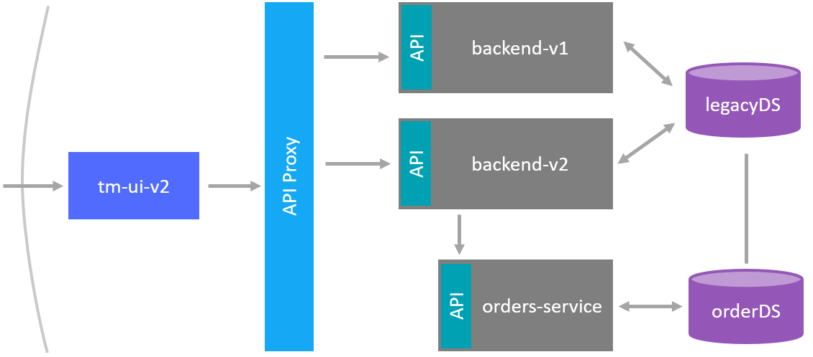
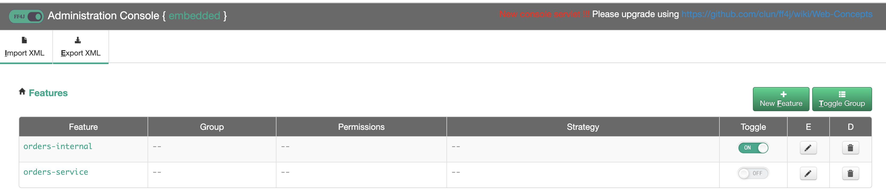
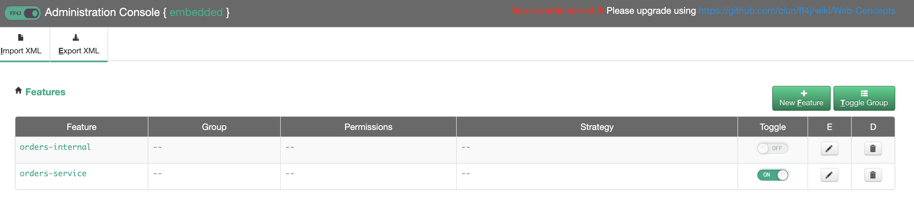
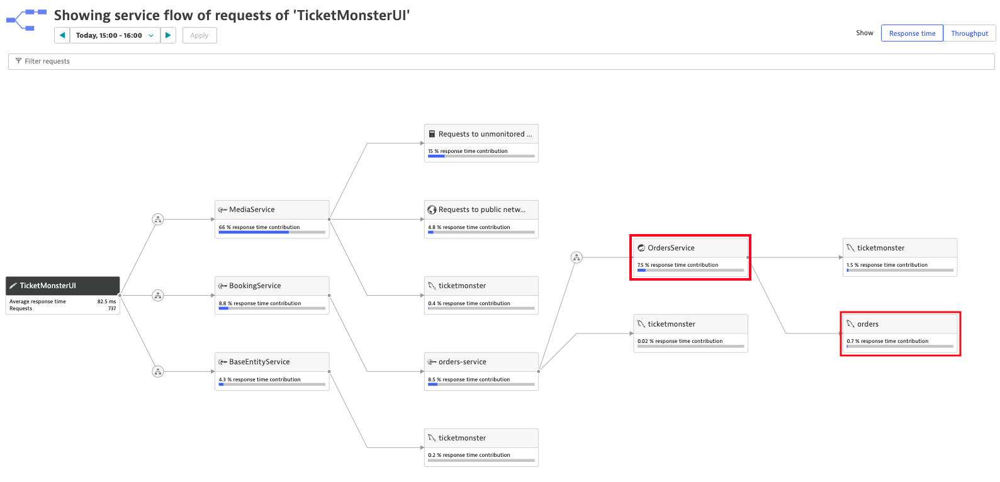

# Deploy the Microservice

Based on the result of the previous labs, you identified the microservice **OrdersService** that has its own code repository and defines its own domain model. To launch this service, it is not recommended to directly route traffic to this new service since we cannot fully ensure that it works as supposed. For this reason, we strangle the microservice around the monolith. In other words, all incoming requests will still be intercepted by the backend service, which forwards synthetic or live traffic to **OrdersService**.

In this lab you'll use feature flags and Kubernetes routing mechanism to smoothly incorporate the new microservice into the monolith. The final state of this lab is shown below:



## Step 1: Deploy the Microservice

1. Create a new application representing the microservice **OrdersService**.
    
    Checkout the `manifests-ticketmonster/ticket-orders.yml` file.
    <details>
        <summary>ticket-orders.yml</summary>

        ---
        apiVersion: extensions/v1beta1
        kind: Deployment
        metadata:
        name: ticketmonster-orders-service
        namespace: ticketmonster
        spec:
        replicas: 1
        template:
            metadata:
            labels:
                app: ticketmonster-orders-service
                version: v1
            spec:
            containers:
            - name: ticketmonster-orders-service
                image: dynatraceacm/ticketmonster-orders-service:latest
                resources:
                limits:
                    cpu: 500m
                    memory: 2048Mi
                requests:
                    cpu: 400m
                    memory: 2048Mi
                ports:
                - containerPort: 8080
                livenessProbe:
                httpGet:
                    path: /health
                    port: 8080
                initialDelaySeconds: 120
                periodSeconds: 10
                timeoutSeconds: 15
                readinessProbe:
                httpGet:
                    path: /health
                    port: 8080
                initialDelaySeconds: 120
                periodSeconds: 10
                timeoutSeconds: 15
            nodeSelector:
                beta.kubernetes.io/os: linux
        ---
        apiVersion: v1
        kind: Service
        metadata:
        name: ticketmonster-orders-service
        labels:
            app: ticketmonster-orders-service
        namespace: ticketmonster
        spec:
        ports:
        - name: http
            port: 8080
            targetPort: 8080
        selector:
            app: ticketmonster-orders-service
        ---
    </details>

    Apply the yaml file to create the service

    ```
    (bastion) $ kubectl create -f manifests-ticketmonster/ticket-orders.yml

    deployment.apps/ticketmonster-orders-service created
    service/ticketmonster-orders-service created
    ```

## Step 2. Deploy a new backend version (v2) of the Monolith
1. Create a new version of the monolith that can deal with the microservice **OrdersService**.
    Checkout the `manifests-ticketmonster/ticket-backend-v2.yml` file. 
    <details>
        <summary>ticket-backend-v2.yml</summary>

        ---
        apiVersion: extensions/v1beta1
        kind: Deployment
        metadata:
        name: ticketmonster-backend-v2
        namespace: ticketmonster
        spec:
        replicas: 1
        template:
            metadata:
            labels:
                app: ticketmonster-backend-v2
                version: v1
            spec:
            containers:
            - name: ticketmonster-backend-v2
                image: dynatraceacm/ticketmonster-backend-v2:latest
                env:
                - name: MYSQL_SERVICE_HOST
                value: ticketmonster-db
                - name: MYSQL_SERVICE_PORT
                value: "3306"
                resources:
                limits:
                    cpu: 500m
                    memory: 1024Mi
                requests:
                    cpu: 400m
                    memory: 768Mi
                ports:
                - containerPort: 8080
                livenessProbe:
                httpGet:
                    path: /ff4j-console
                    port: 8080
                initialDelaySeconds: 120
                periodSeconds: 10
                timeoutSeconds: 15
                readinessProbe:
                httpGet:
                    path: /ff4j-console
                    port: 8080
                initialDelaySeconds: 120
                periodSeconds: 10
                timeoutSeconds: 15
            nodeSelector:
                beta.kubernetes.io/os: linux
        ---
        apiVersion: v1
        kind: Service
        metadata:
        name: ticketmonster-backend-v2
        labels:
            app: ticketmonster-backend-v2
        namespace: ticketmonster
        spec:
        ports:
        - name: http
            port: 80
            targetPort: 8080
        selector:
            app: ticketmonster-backend-v2
        type: LoadBalancer
        ---
    </details>

    Apply the yaml file to create the service.

    ```
    (bastion) $ kubectl apply -f manifests-ticketmonster/ticket-backend-v2.yml

    deployment.apps/ticketmonster-backend-v2 created
    service/ticketmonster-backend-v2 created
    ```


1. Create a new version of the ui that can deal with the new backend **OrdersService**.
    Checkout the `manifests-ticketmonster/ticket-ui-v2.yml` file. This deployment has a `BACKENDURL` environment variable that is set to the `ticketmonster-backend-v2` which can handle the new `OrdersService`
    <details>
        <summary>ticket-ui-v2.yml</summary>

        ---
        apiVersion: extensions/v1beta1
        kind: Deployment
        metadata:
        name: ticketmonster-ui
        namespace: ticketmonster
        spec:
        replicas: 1
        template:
            metadata:
            labels:
                app: ticketmonster-ui
                version: v1
            spec:
            containers:
            - name: ticketmonster-ui
                image: dynatraceacm/ticketmonster-ui-v1:latest
                env:
                - name: BACKENDURL
                value: ticketmonster-backend-v2
                resources:
                limits:
                    cpu: 500m
                    memory: 1024Mi
                requests:
                    cpu: 400m
                    memory: 768Mi
                ports:
                - containerPort: 8080
                livenessProbe:
                httpGet:
                    path: /
                    port: 8080
                initialDelaySeconds: 30
                periodSeconds: 10
                timeoutSeconds: 15
                readinessProbe:
                httpGet:
                    path: /
                    port: 8080
                initialDelaySeconds: 30
                periodSeconds: 10
                timeoutSeconds: 15
            nodeSelector:
                beta.kubernetes.io/os: linux
        ---
        apiVersion: v1
        kind: Service
        metadata:
        name: ticketmonster-ui
        labels:
            app: ticketmonster-ui
        namespace: ticketmonster
        spec:
        ports:
        - name: http
            port: 80
            targetPort: 8080
        selector:
            app: ticketmonster-ui
        type: LoadBalancer
        ---
    </details>

    Apply the yaml file to create the service.

    ```
    (bastion) $ kubectl apply -f manifests-ticketmonster/ticket-ui-v2.yml

    deployment.apps/ticketmonster-ui configured
    service/ticketmonster-ui unchanged
    ```

## Step 3: Switch feature flag and test your Microservice

1. Wait for the updated pod to come online and get the public endpoint of the backend **ticketmonster-backend-v2**.
    ```
    (bastion) $ kubectl -n ticketmonster get service/ticketmonster-backend-v2
    NAME                       TYPE           CLUSTER-IP        EXTERNAL-IP     PORT(S)        AGE
    ticketmonster-backend-v2   LoadBalancer   10.21.0.212       xxx.xxx.xxx.xxx 80:32526/TCP   3m46s
    ```

1. In your browser, navigate to your `ff4j` console: `http://<your-backend>/ff4j-console`. You will be able to switch on/off your new microservice from here. 



1. By default, ff4j is configured to have the `orders-internal` feature flag enabled which will continue using the legacy orders implementation.

1. To start using the new orders microservice, disable the `orders-internal` feature flag and enable the `orders-service` as shown below:



## Step 4: Verify that the new microservice and database are now in use

1. Open ticketmonster-ui on a browser and order a ticket again, the order will be operated and persisted by the **OrdersService** instead of the monolithic booking service (in fact, the booking service calls the OrderService).

1. We can verify the service flow in Dynatrace.
    1. From the left menu, choose the **Transaction & services** tab.
    1. Select service **TicketMonsterUI**.
    1. Click on **View service flow**.
    1. Finally, you see the service flow containing the microservice `OrdersService`.



## Step 6 - Important - Clean up resources created
To free up some resources for the next labs we will need to delete our ticketmonster application.

    kubectl delete ns ticketmonster
    docker stop $USER

---
[Previous Step: Domain Model of Microservice](../6_Domain_Model_of_Microservice) :arrow_backward:

:arrow_up_small: [Back to overview](../)
