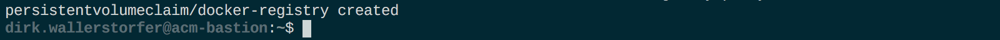
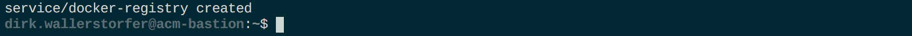
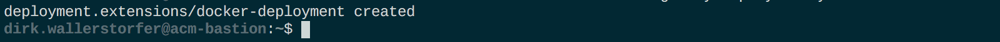
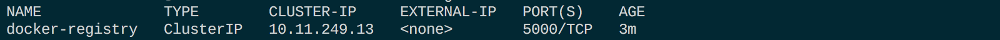
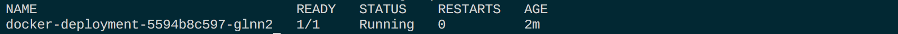

# Deploy Docker Registry

We use the Docker registry to save the build artifacts, i.e. Docker containers. The registry allows us to host multiple versions of an artifact. 

## Steps
1. In Preparation for deploying the Docker registry we're going to use throughout the week, we want to create some Kubernetes namespaces (`~/manifests-env-zero/k8s-namespaces.yml`):
    - `cicd`: hosts all CI/CD related pods and services
    - `dev`: represents the development stage
    - `stage`: represents the staging stage
    - `production`: represents the production stage

    ```
    (bastion)$ cd
    (bastion)$ kubectl create -f manifests-env-zero/k8s-namespaces.yml
    ```

    Expected output:

    

1. We create a `PersistentVolumeClaim` (PVC) where Docker images of the registry will be stored. We use a PVC to have persistent data, even when the pod is restarted. 

    ```
    (bastion)$ kubectl create -f manifests-docker-registry/k8s-docker-registry-pvc.yml
    ```

    Expected output:

    

1. We create the service and the deployment for the Docker registry.

    ```
    (bastion)$ kubectl create -f manifests-docker-registry/k8s-docker-registry-service.yml
    ```
    
    Expected output:

    

    ```
    (bastion)$ kubectl create -f manifests-docker-registry/k8s-docker-registry-deployment.yml
    ```

    Expected output: 

    

1. Ensure the Docker registry service, the deployment, and the corresponding pods are running. **Write down the IP address of the service** - we'll need it in the next step.

    ```
    (bastion)$ kubectl -n cicd get services
    ```

    Expected output: 

    

    ```
    (bastion)$ kubectl -n cicd get deployments
    ```

    Expected output: 

    

    ```
    (bastion)$ kubectl -n cicd get pods
    ```

    Expected output: 

    

---

[Previous Step: Prepare Environment](../0_Prepare_Environment) :arrow_backward: :arrow_forward: [Next Step: Deploy Gitea](../2_Deploy_Gitea)

:arrow_up_small: [Back to overview](../)
