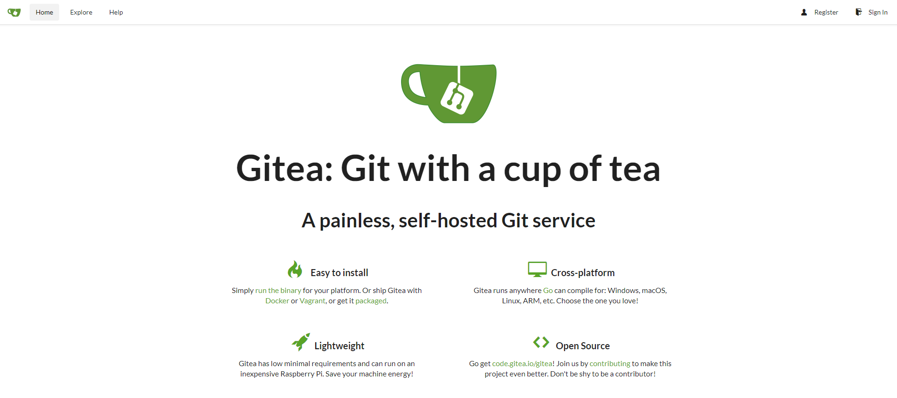
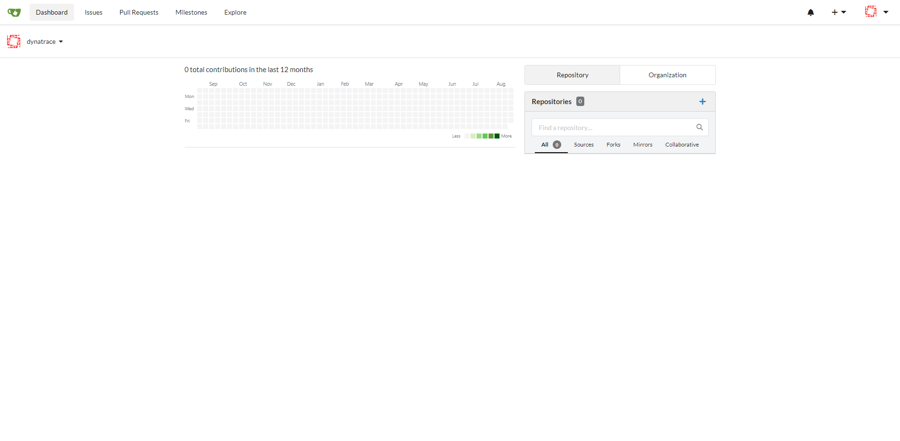
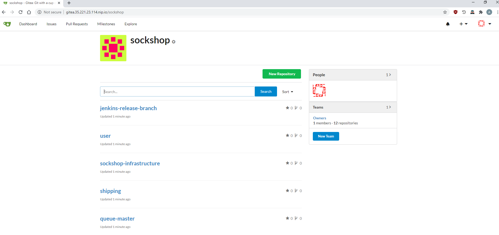

# Deploy Gitea

## Prerequisites
* Access to your bastion host
* Certificate Manager deployed
* Ingress Controller deployed
* Docker Registry deployed

## Steps

1. Connect to the bastion host ussing ssh and your credentials.

1. Execute the `deployGitea.sh` script in your home directory.

    ```
    (bastion)$ cd ~
    (bastion)$ ./deployGitea.sh
    ```

    This script configures Gitea - a community managed lightweight code hosting solution written in Go. Gitea will host all of the repositories for our application, which we will fork in the next step.

    ```
    (bastion)$ ./deployGitea.sh
    REGISTRY_URL: XXX.XXX.XXX.XXX
    INGRESS_DOMAIN: XXX.XXX.XXX.XXX.nip.io
    persistentvolumeclaim/maven-repo created
    "k8s-land" has been added to your repositories
    Deploying Gitea using Helm... This will take a few minutes
    deployment "gitea-gitea" successfully rolled out
    Defaulting container name to gitea.
    Use 'kubectl describe pod/gitea-gitea-6f98b6f845-nb2rb -n cicd' to see all of the containers in this pod.
    Admin PAT: <YOUR GENERATED PERSONAL ACCESS TOKEN>
    Updating PAT in ./creds.json
    Gitea can be reached at http://gitea.XXX.XXX.XXX.XXX.nip.io
    ```
    
    Gitea can now be reached at the `http://gitea.<YOUR_EXTERNAL_IP>.nip.io`. You should see the Gitea home screen when you initially access this page:

    
    <br />
    You can log in to Gitea using username: `dynatrace` and password: `dynatrace`
    <br />
    

1. Execute the `./forkGitHubRepositories.sh` script in your home directory. 

    ```
    (bastion)$ cd ~
    (bastion)$ ./forkGitHubRepositories.sh
    ```
    This will fork the Sockshop repositories to Gitea, allowing us to work with them locally.

    Please verify that you can now see the twelve Sockshop repositories in the Sockshop organization in Gitea:

    

    <br />
    Spend a moment reviewing what repos were created and browse through to understand the repo structure

---

[Previous Step: Deploy Docker Registry](../1_Deploy_Docker_Registry) :arrow_backward: :arrow_forward: [Next Step: Deploy Jenkins](../3_Deploy_Jenkins)

:arrow_up_small: [Back to overview](../)
