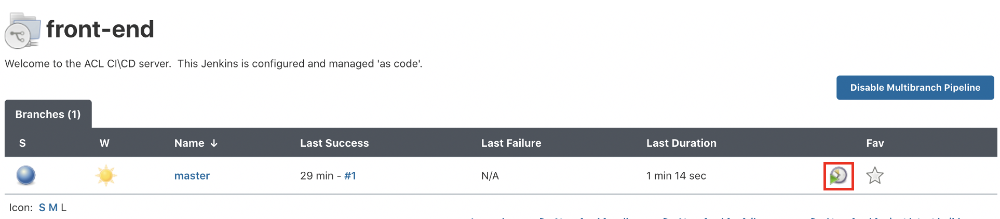

# Trigger Build Pipelines

In this lab, we'll deploy the sockshop application to the `dev` namespace.

## Steps

1. Navigate to the *Sockshop folder* in the Jenkins home page.

    

1. Click on the sort by `last build status` button to sort the pipelines by their type and then click on each of the `multi-branch` projects separately to trigger the builds one by one:

    

1. Trigger the build by clicking on the `Schedule a Build` button on the right side of the `master` branch:

    

1. If all builds completed successfully, you should see something like this:

    

1. If there are any builds that failed, you will see a storm cloud next to the name of the job:

    

1. Re-trigger the build for any failed jobs by opening the project and then clicking on the `Schedule a Build` button on the right side of the `master` branch:

    

1. This lab concludes, once all build pipelines have been run successfully.

---

[Previous Step: Deploy Jenkins](../3_Deploy_Jenkins) :arrow_backward: :arrow_forward: [Next Step: Clone GitHub Repositories](../5_Clone_Gitea_Repositories)

:arrow_up_small: [Back to overview](../)
