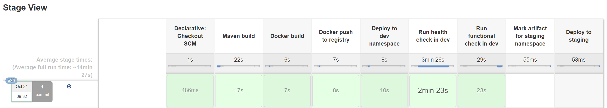

# Deploy the Carts Service to Dev Environment

In this lab you'll learn how the Jenkins pipeline is designed to build, deploy, and test a microservice after pushing a source code change to its repository. The following screenshot shows the different stages of the CI pipeline in an overview.


## Step 1: Modify a Microservice

1. View the currently configured health checks on the carts microservice:
    - Expected output `{"health":[{"service":"carts","status":"OK","date":"2019-12-10T15:50:01.899Z"}]}`
    - The carts health url endpoint that can be retrieved with the following command:

    ```bash
    (bastion)$ echo http://$(kubectl -n dev get svc carts -o json | jq -r .status.loadBalancer.ingress[].ip)/health
    ```

1. Switch to the `carts` repository and open file `src/main/java/works/weave/socks/cart/controllers/HealthCheckController.java`. 
1. Activate the code sections that address the database connection test and save file (i.e., remove all comments).
1. Commit/Push the changes.

## Step 2. Build new Version in Jenkins

1. Go to **Jenkins** and **sockshop**.
1. Click on **carts** pipeline and **Scan Multibranch Pipeline Now**.
1. Click on the **build** and open the **Console output** to follow the progress of the pipeline.
1. View the newly configured health checks on the carts microservice:
    - Expected output: `{"health":[{"service":"carts","status":"OK","date":"2019-12-10T15:47:32.434Z"},{"service":"carts-db","status":"OK","date":"2019-12-10T15:47:32.434Z"}]}`
    - The carts health url endpoint can be retrieved from the command on step 1.

---

[Previous Step: Deep Dive into Carts Service](../01_Deep_Dive_into_Carts_Service) :arrow_backward: :arrow_forward: [Next Step: Deploy Microservice to Staging](../03_Deploy_Microservice_to_Staging)

:arrow_up_small: [Back to overview](../)
