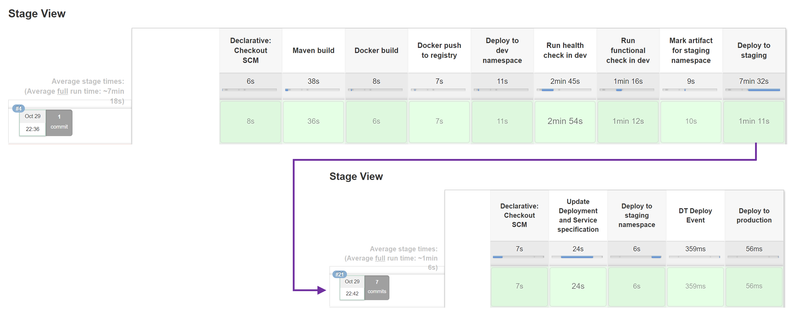

# Release a Microservice to Staging Environment

In this lab you'll learn how to use the Jenkins pipeline to release a microservice to the staging environment. Therefore, the initial step is creating a release branch based on the current version (e.g., *release/0.2.4*). Then the pipeline stored in the repository of a microservice (e.g., carts) prepares the deployment and triggers another pipeline, which is stored in the *k8s-deploy-staging* repository. In fact, the *k8s-deploy-staging* repository reflects the current state of staging by keeping and maintaining the service and deployment specification of each microservice. 

The following screenshot depicts the interaction between the two pipelines.

## Step 1: Create a new Release

1. Go to **Jenkins** and **sockshop**.
1. Click on **create-release-branch** pipeline and **Schedule a build with parameters**.
1. For the parameter **SERVICE**, enter the name of the service you want to create a release for (**carts**)

    The pipeline does the following:
    1. Reads the current version of the microservice.
    1. Creates a release branch with the name release/**version**.
    1. Increments the current version by 1.
    1. Commits/Pushes the new version to the Git repository.

## Step 2. Build new Release in Jenkins
1. After the **create-release-branch** pipeline has finished, go to **Jenkins** and **sockshop**.
1. Click on **carts** pipeline and **Scan Multibranch Pipeline Now**.
1. Hit **F5** and you should see the new branch, which gets built and deployed to staging.

---

[Previous Step: Deploy Microservice to Dev](../02_Deploy_Microservice_to_Dev) :arrow_backward: 

:arrow_up_small: [Back to overview](../)