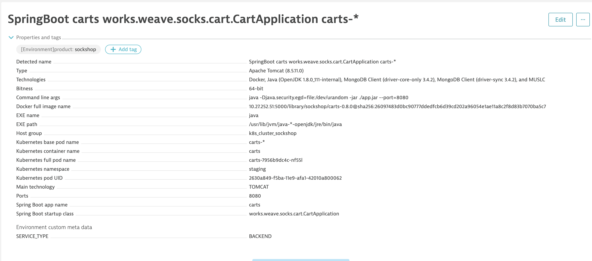

# Pass and Extract Meta-Data for each deployed Process or Container

In this lab you learn which meta-data is captured automatically, how to pass custom meta-data and how you can use this meta-data to influence process group detection and automated tagging.

The OneAgent automatically captures a lot of meta-data for each process which will be propagated to the Process Group Instance (PGI) and the Process Group (PG) itself, e.g.: Technology, JVM Version, Docker Image, Kubernetes pod names, service version number, etc. You can add additional meta-data to every processes [via the environment variable like DT_CUSTOM_PROP, DT_TAGS](https://www.dynatrace.com/support/help/infrastructure/processes/how-do-i-define-my-own-process-group-metadata/)

* *Which additional Meta-data should we pass?*
It depends on your environment but here are some ideas, e.g.: Build Number, Version Number, Team Ownership, or Type of Service.

* *Using Meta-data (How and Use Cases):*
You can use custom and existing meta-data from, e.g.: Java Properties, Environment Variables, or Process Properties to influence [Process Group Detection](https://www.dynatrace.com/support/help/infrastructure/processes/can-i-customize-how-process-groups-are-detected/) as well as [Rule-based Tagging](https://www.dynatrace.com/news/blog/automated-rule-based-tagging-for-services/).

## Step 1: Pass Meta-data via Custom Environment Variables

1. Switch to the `carts/` directory and open `./manifest/carts.yml`.

1. Verify that the **DT_TAGS** and **DT_CUSTOM_PROP** environment variables appear as shown below.
    ```
    env:
      - name: JAVA_OPTS
        value: -Xms128m -Xmx512m -XX:PermSize=128m -XX:MaxPermSize=128m -XX:+UseG1GC -Djava.security.egd=file:/dev/urandom
      - name: DT_TAGS
        value: "product=sockshop"
      - name: DT_CUSTOM_PROP
        value: "SERVICE_TYPE=BACKEND"
    ```

1. Identify the tag and custom meta-data in Dynatrace for the *carts* service and process group as shown below.



<!-- 
## Step 2 (Optional): Influence PGI Detection to detect each Build as separate PGI

For this step it is necessary to add the **DT_NODE_ID** environment variable to the service definition. This changes the default PGI detection mechanism and every docker instance, even if it comes from the same docker image, will be split into its own PGI. **Note: for Kubernetes, OpenShift, CloudFoundry:** For these platforms the OneAgent automatically detects containers running in different pods, spaces, or projects. There should be no need to leverage **DT_NODE_ID** to separate your container instances.

1. Open `./manifest/carts.yml` again.

1. Add the **DT_NODE_ID** environment variable with the value shown below.
    ```
    env:
      - name: JAVA_OPTS
        value: -Xms128m -Xmx512m -XX:PermSize=128m -XX:MaxPermSize=128m -XX:+UseG1GC -Djava.security.egd=file:/dev/urandom
      - name: DT_TAGS
        value: "SERVICE_TYPE=BACKEND"
      - name: DT_CUSTOM_PROP
        value: "SERVICE_TYPE=BACKEND"
      - name: DT_NODE_ID
        value: to-be-replaced-by-jenkins
    ```

1. Open `Jenkinsfile` of carts.

1. In the `steps` section of stage `Deploy to dev namespace`, add the following `sed` command right before the `kubectl apply`.
    ```
    sh "sed -i 's#value: to-be-replaced-by-jenkins.*#value: ${env.VERSION}-${env.BUILD_NUMBER}#' manifest/carts.yml"      
    ```

1. Commit/Push the changes to your GitHub Repository *carts*. 

1. Open `Jenkinsfile` of k8s-deploy-staging.

1. In the `steps` section of stage `Update Deployment and Service specification`, add the following `sed` command right before the `kubectl apply`.
 (1) Remark: Staging pipeline needs ${env.BUILD_NUMBER} parameter!
    ```
    sh "cd k8s-deploy-staging/ && sed -i 's#value: to-be-replaced-by-jenkins.*#value: ${env.VERSION}-${env.BUILD_NUMBER}#' ${env.APP_NAME}.yml"
    ```

1. Commit/Push the changes to your GitHub Repository *k8s-deploy-staging*. 

1. k8s-production-staging

1. Re-deploy the carts service by triggering the Jenkins pipeline.

-->

---

[Previous Step: Instrument Cluster with Dynatrace OneAgent](../01_Instrument_Cluster_with_Dynatrace_OneAgent) :arrow_backward: :arrow_forward: [Next Step: Tagging of Services](../03_Tagging_and_Naming_of_Services)

:arrow_up_small: [Back to overview](../)
