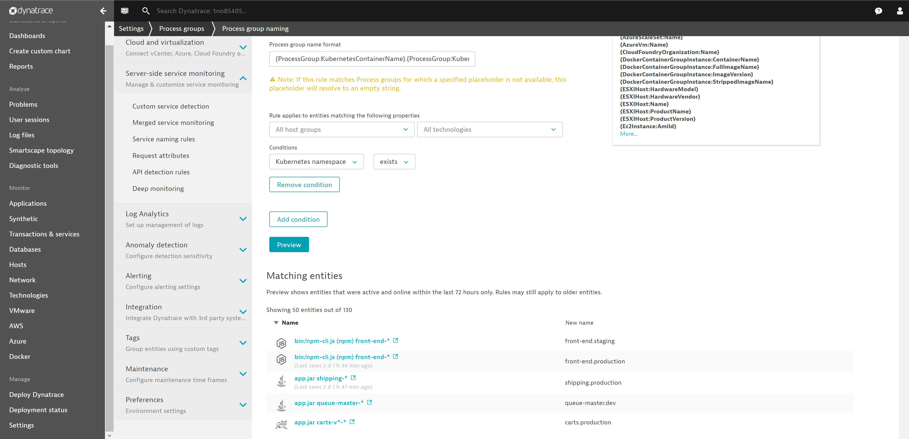
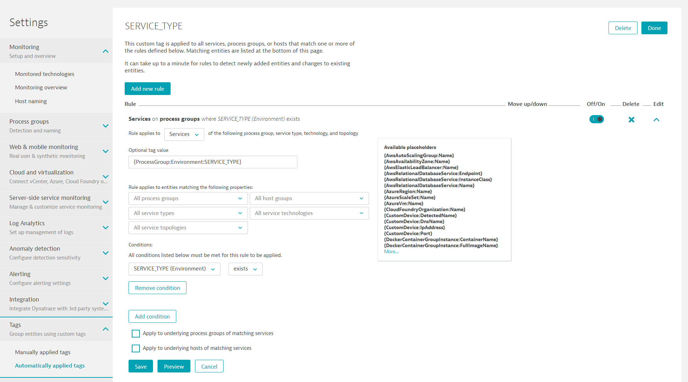
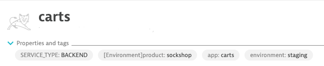

# Tagging of Services and Naming of Process Groups

In this lab you'll learn how to automatically apply tags on service level. This allows you to query service-level metrics (e.g.: Response Time, Failure Rate, or Throughput) automatically based on meta-data that you have passed during a deployment, e.g.: *Service Type* (frontend, backend), *Deployment Stage* (dev, staging, production). Besides, this lab creates tagging rules based on Kubernetes namespace and Pod name.

In order to tag services, Dynatrace provides **Automated Service Tag Rules**. In this lab you want Dynatrace to create a new service-level tag with the name **SERVICE_TYPE**. It should only apply the tag *if* the underlying Process Group has the custom meta-data property **SERVICE_TYPE**. If that is the case, you also want to take this value and apply it as the tag value for **Service_Type**.

## Step 1: Create a Naming Rule for Process Groups
1. Go to **Settings**, **Process and containers**, and click on **Process group naming**.
1. Create a new process group naming rule with **Add new rule**. 
1. Edit that rule:
    * Rule name: `Container.Namespace`
    * Process group name format: `{ProcessGroup:KubernetesContainerName}.{ProcessGroup:KubernetesNamespace}`
    * Condition: `Kubernetes namespace`> `exists`
1. Click on **Preview** and **Create rule**.

Screenshot shows this rule definition.

## Step 2: Create Service Tag Rule
1. Go to **Settings**, **Tags**, and click on **Automatically applied tags**.
1. Create a new custom tag with the name `SERVICE_TYPE`.
1. Edit that tag and **Add new rule**.
    * Rule applies to: `Services` 
    * Optional tag value: `{ProcessGroup:Environment:SERVICE_TYPE}`
    * Condition on `Process group properties -> SERVICE_TYPE (Environment)` if `exists`
1. Click on **Preview** to validate rule works.
1. Click on **Create rule** for saving the rule and then **Save changes**.

Screenshot shows this rule definition.

## Step 3: Search for Services by Tag
It will take about 30 seconds until the tags are automatically applied to the services.
1. Go to **Transaction & services**.
1. Click in **Filtered by** edit field.
1. Select `Tag`:`SERVICE_TYPE` and select `FRONTEND`.
1. You should see the service `front-end`. Open it up.

## Step 4: Create Service Tag for App Name based on K8S Container Name
1. Go to **Settings**, **Tags**, and click on **Automatically applied tags**.
1. Create a new custom tag with the name `app`. **THIS TAG NAME IS CASE SENSITIVE.**
1. Edit that tag and **Add new rule**.
    * Rule applies to: `Services` 
    * Optional tag value: `{ProcessGroup:KubernetesContainerName}`
    * Condition on `Kubernetes container name` if `exists`
1. Click on **Preview** to validate rule works.
1. Click on **Create rule** for saving the rule and then **Save changes**.

## Step 5: Create Service Tag for Environment based on K8S Namespace
1. Go to **Settings**, **Tags**, and click on **Automatically applied tags**.
1. Create a new custom tag with the name `environment`. **THIS TAG NAME IS CASE SENSITIVE.**
1. Edit that tag and **Add new rule**.
    * Rule applies to: `Services` 
    * Optional tag value: `{ProcessGroup:KubernetesNamespace}`
    * Condition on `Kubernetes namespace` if `exists`
1. Click on **Preview** to validate rule works.
1. Click on **Create rule** for saving the rule and then **Save changes**.

## Result: Cart is tagged as shown below
Screenshot shows tags for cart service

* 

---

[Previous Step: Pass and Extract Meta-Data for Process or Container](../02_Pass_Extract_Meta-Data_for_Process_or_Container) :arrow_backward: :arrow_forward: [Next Step: Push Events to Dynatrace](../04_Push_Events_to_Dynatrace)

:arrow_up_small: [Back to overview](../)
