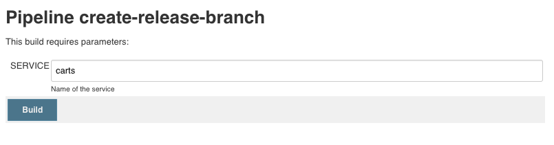

# Deploy Sockshop to Staging and validate Automation

Now as you have everything correctly setup and configured for the first environment (i.e., the *dev* environment), let's see how the automation works for the second environment (i.e., the *staging* environment) by following this lab. To deploy services to staging it is necessary to create a release branch first. Afterwards, the execution of the Jenkins pipeline automatically detects this release branch und deploys the service to staging.  

## Step 1: Create release branches for all microservices

1. Go to **Jenkins** and **sockshop**.
1. Click on **create-release-branch** pipeline and **Schedule a build with parameters**.
1. For the parameter **SERVICE**, enter the name of the service you want to create a release for (**carts**)

    The pipeline does the following:
    1. Reads the current version of the microservice.
    1. Creates a release branch with the name release/**version**.
    1. Increments the current version by 1. 
    1. Commits/Pushes the new version to the Git repository.

1. Create `orders` release branch as shown above.
1. Create `shipping` release branch as shown above.
1. Create `queue-master` release branch as shown above.
1. Create `front-end` release branch as shown above.
1. Create `user` release branch as shown above.
1. Create `payment` release branch as shown above.
1. Create `catalogue` release branch as shown above.

## Step 2. Build new Release in Jenkins
1. After the **create-release-branch** pipeline has finished, go to **Jenkins** and **sockshop**.
1. Click on the pipeline for each service and **Scan Multibranch Pipeline Now**.
1. Hit **F5** and you should see the release branch, which gets built and deployed to staging. 

---

[Previous Step: Define Management Zones](../05_Define_Management_Zones) :arrow_backward: :arrow_forward: [Next Step: Setup Notification Integration](../07_Setup_Notification_Integration)

:arrow_up_small: [Back to overview](../)
