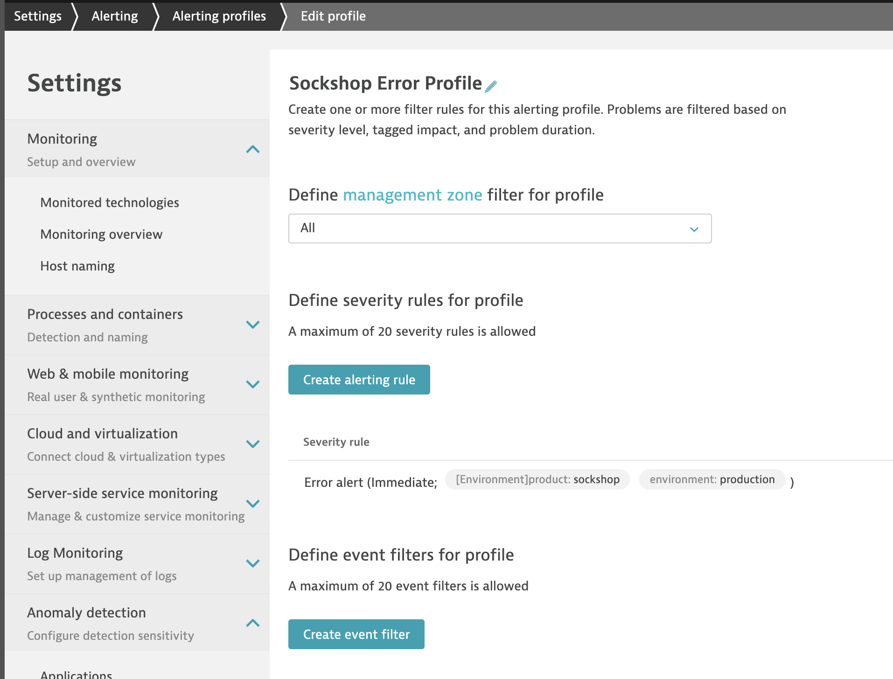

# Setup Alerting Profile for availability issues and configure email notification

In this lab you'll learn how to define an alerting profile for a particular problem identified by Dynatrace. Based on that alerting profile, an email notification will be send to a person who is in charge of the issue. 

## Step 1: Create an Alerting Profile via the configuration API

1. In this step we will leverage the dynatrace configuration API to automatically create an alerting profile along with all of its filters and rules.
1. Run the `createAlertingProfile.sh` script located on your home directory to automatically create the required alerting profile:

    ```bash
    bastion:$ cd ~
    bastion:$ ./createAlertingProfile.sh
    ```

1. (Optional) Review the `createAlertingProfile.sh` script to understand what will be created and how the API works.

1. Confirm that the newly created alerting profile should look like this:



## Step 2: Set up Email Notification

1. Go to **Settings**, **Integration** and click on **Problem notifications**.
1. Click on **+ Set up notifications** and select **Email**.
1. Specify the name for the notification, e.g., `Service Notification`.
1. Specify the email address of the receiver.
1. Set the following email subject: `{State} Problem {ProblemID}: {ImpactedEntity}`.
1. Select the previous created Alerting profile: `Sockshop Error Profile`.
1. Finally, **Send test notification** before clicking on **Save**.

---

[Previous Step: Deploy Sockshop to Staging](../06_Deploy_Sockshop_to_Staging) :arrow_backward:

:arrow_up_small: [Back to overview](../)
