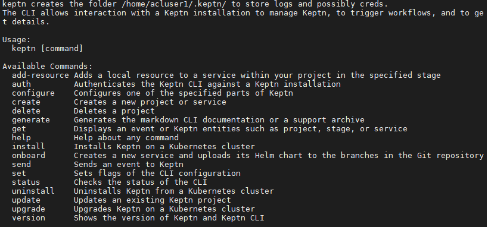
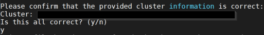
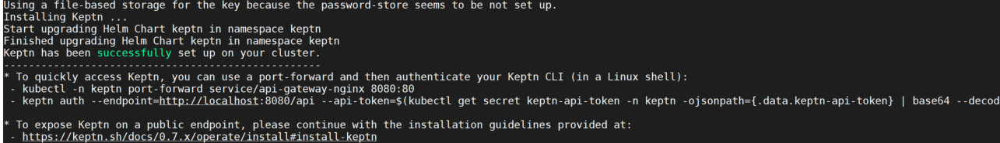

# Install keptn

We will install [Keptn](https://keptn.sh/) on your GKE cluster and use the quality gates and self-healing capabilities in the following labs.

## Step 1: Verify the keptn CLI has already been installed

1. Execute the following command to check the keptn CLI has been installed

    ```bash
    (bastion)$ keptn
    ```

1. You will be presented with a response like the following:



## Step 2: Install the keptn runtime

1. To install the keptn runtime on your cluster, execute the following command:

    ```bash
    (bastion)$ keptn install --endpoint-service-type=ClusterIP
    ```

1. The installer will ask you for the following information:
    - Cluster name (should already be prefilled)

    

1. Confirm your entry. The keptn installation process will commence.


## Step 3: Expose keptn

1. Run the following script to expose keptn using the existing nginx ingress controller:

    ```bash
    (bastion)$ cd
    (bastion)$ ./exposeKeptn.sh
    ```

## Step 4: Authenticate keptn CLI

1. Export the keptn api endpoint and API token as environment variables

    ```bash
    (bastion)$ export KEPTN_ENDPOINT=http://$(kubectl -n keptn get ingress keptn -ojsonpath='{.spec.rules[0].host}')/api
    (bastion)$ export KEPTN_API_TOKEN=$(kubectl get secret keptn-api-token -n keptn -ojsonpath={.data.keptn-api-token} | base64 --decode)
    ```

1. Use this stored information and authenticate the CLI.

    ```bash
    (bastion)$ keptn auth --endpoint=$KEPTN_ENDPOINT --api-token=$KEPTN_API_TOKEN
    ```

1. If you want, you can go ahead and take a look at the Keptn API by navigating to the endpoint that is given via

    ```bash
    (bastion)$ echo $KEPTN_ENDPOINT
    ```

## Step 5: Authenticate keptn bridge

After installing and exposing Keptn, you can access the Keptn Bridge by using a browser and navigating to the Keptn endpoint.

1. To get the keptn bridge url, run the following commmands:

    ```bash
      (bastion)$ export KEPTN_BRIDGE=http://$(kubectl -n keptn get ingress keptn -ojsonpath='{.spec.rules[0].host}')/bridge
      (bastion)$ echo $KEPTN_BRIDGE
    ```

1. The keptn bridge has basic authentication enabled by default and the default user is keptn with an automatically generated password.

    ```bash
    (bastion)$ keptn configure bridge --output
    ```

:arrow_forward: [Next Step: Configure Monitoring with Keptn](../02_Configure_Keptn_Dynatrace_Integration)

:arrow_up_small: [Back to overview](../)