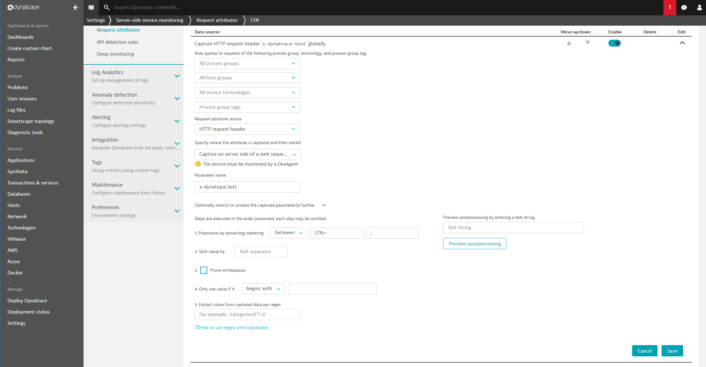

# Define Request Attributes in Dynatrace
In this lab you will learn how to capture request attributes in Dynatrace based on web request data. In more detail, the data stored in the request header `x-dynatrace-test` will be extracted to create request attributes that tag and distinguish service traffic. 

For further information on how to capture request attributes, [please see this page in the Dynatrace documentation.](https://www.dynatrace.com/support/help/monitor/transactions-and-services/request-attributes/how-do-i-capture-request-attributes-based-on-web-request-data/)

## Step 1: Create Request Attribute for Load Test Name (LTN)
1. Go to **Settings**, **Server-side monitoring**, and click on **Request attributes**.
1. Click the **Define new request attribute** button.
1. Provide a unique *Request attribute name*: `LTN`.
1. Click on **Add new data source**.
1. Select the *Request attribute source*: `HTTP request header`.
1. Specify the *Parameter name*: `x-dynatrace-test`.
1. Open *Optionally restrict or process the captured parameter(s) further*
1. At *Preprocess by extracting substring* set: `between` > `LTN=` > `;`
1. Finally, click **Save**, click **Save**.

Screenshot shows this rule definition.

## Step 2: Create Request Attribute for Load Script Name (LSN)
1. Go to **Settings**, **Server-side monitoring**, and click on **Request attributes**.
1. Click the **Create new request attribute** button.
1. Provide a unique *Request attribute name*: `LSN`.
1. Click on **Add new data source**.
1. Select the *Request attribute source*: `HTTP request header`.
1. Specify the *Parameter name*: `x-dynatrace-test`.
1. Open *Optionally restrict or process the captured parameter(s) further*
1. At *Preprocess by extracting substring* set: `between` > `LSN=` > `;`
1. Finally, click **Save**, click **Save**.

## Step 3: Create Request Attribute for Test Script Name (TSN)
1. Go to **Settings**, **Server-side monitoring**, and click on **Request attributes**.
1. Click the **Create new request attribute** button.
1. Provide a unique *Request attribute name*: `TSN`.
1. Click on **Add new data source**.
1. Select the *Request attribute source*: `HTTP request header`.
1. Specify the *Parameter name*: `x-dynatrace-test`.
1. Open *Optionally restrict or process the captured parameter(s) further*
1. At *Preprocess by extracting substring* set: `between` > `TSN=` > `;`
1. Finally, click **Save**, click **Save**.

---

[Previous Step: Configure Jenkins Library](../03_Configure_Jenkins_Library) :arrow_backward: :arrow_forward: [Next Step: Write Load Test script](../05_Write_Load_Test_Script)

:arrow_up_small: [Back to overview](../)
