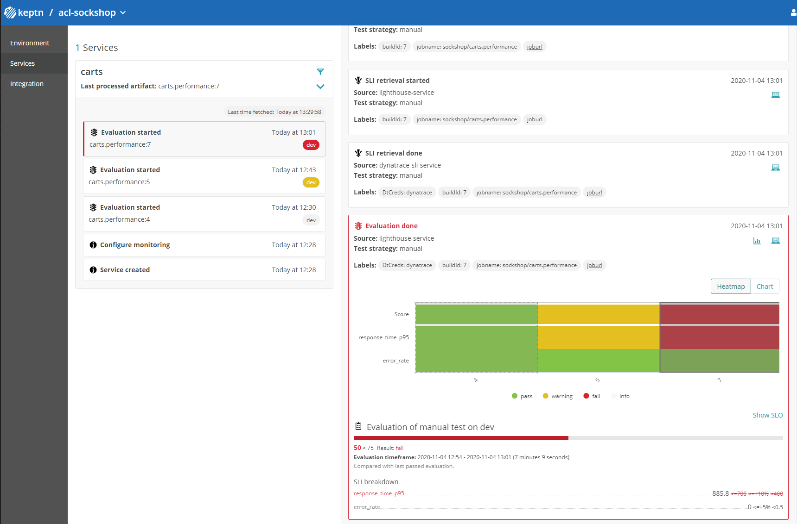
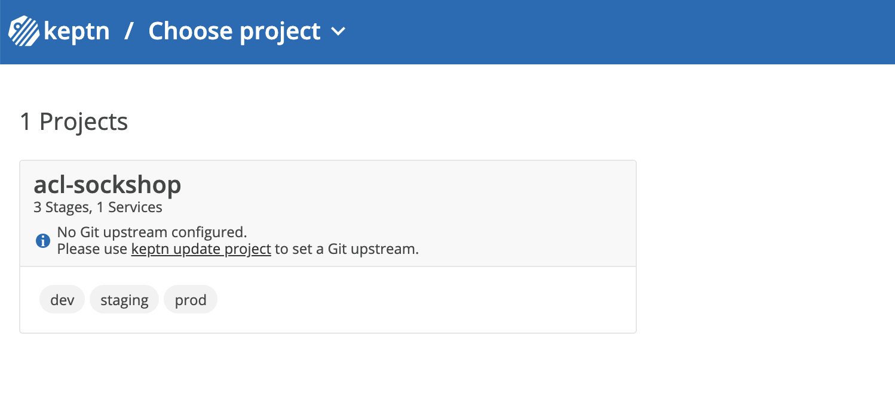
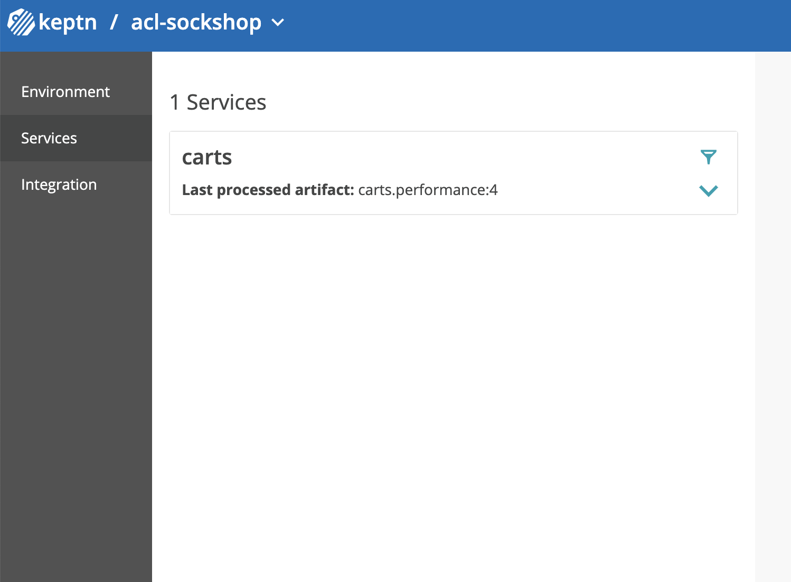

# Analyze results in Keptn Bridge

In this lab you'll learn how to leverage the keptn bridge to analyze the differences between the three performance tests and it's relation to the SLI/SLO definitions.



## Step 1: Go to the keptn bridge

1. Go to the keptn bridge url and login with the username and password as demonstrated in the [Install keptn lab](../01_Install_Keptn).

1. Select the project `acl-sockshop` to visualize the services part of the project:


1. Click on the `carts` service tile to expand the available events and select the first of the `evaluation started` events.


As you can see, the right panel shows the history for the evaluation events and the evaluation result compared with the previous builds for each SLO defined.

During our first run the retrieved metric values from dynatrace did not exceed the threshold of any of the 2 objectives defined meaning a passing score will be the result of the evaluation.

```yaml
90 <= 100  Result: pass
SLI breakdown
response_time_p95: 204.9<=+10%<400 (this can be a different value during your run, we will see why by using dynatrace during the next lab)
error_rate: 0<=+5%<0.5
```

During our second run, one of the two objectives exceeded the warning threshold set between 400ms to 700ms for the metric `response_time_p95` this resulted in a warning score of 75.

```yaml
75 <= 75 < 90  Result: warning
- response_time_p95: 604.9<=700<=+10%<400 (this can be a different value during your run, we will see why by using dynatrace during the next lab)
- error_rate: 0<=+5%<0.5
```

During our third run, one of the two objectives exceeded the failure threshold after getting a result over 700ms for the metric `response_time_p95` this resulted in a failing score of 50.

```yaml
50 < 75  Result: fail
- response_time_p95: 899<=700<=+10%<400 (this can be a different value during your run, we will see why by using dynatrace during the next lab)
- error_rate: 0<=+5%<0.5
```

---

[Previous Step: Run Performance Tests](../07_Run_Performance_Tests) :arrow_backward: :arrow_forward: [Next Step: Compare Tests in Dynatrace](../09_Compare_Tests_in_Dynatrace)

:arrow_up_small: [Back to overview](../)