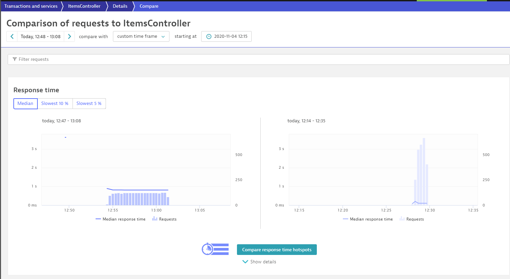

# Compare Tests in Dynatrace

In this lab you'll learn how to leverage dynatrace to identify the difference between performance tests. A couple of clicks can tell you the reason why one build was slower compared to the other.

## Step 1: Locate the carts service

1. In dynatrace go to Transactions and services
1. Click on **Filtered by** and select `Tag:environment:dev`.
1. Select the service ItemsController.
1. You should be able to visualize the 3 Custom info events on the bottom right panel of the service.

## Step 2: Analyze the traffic

1. Click on the `Create analysis view` button located on the **Multidimensional analysis views** tile of the service.
1. Select **Response time** on the Metric dropdown.
1. On the timeframe selector pick a time window that allows you to visualize the 3 performance tests, you can use the timestamp of the performance evaluation result events pushed by keptn to the `itemsController` service.
1. Click on create analysis view.
1. Set Aggregation to `95th percentile`
1. Split by dimension `{RequestAttribute:TSN} - {RequestAttribute:LTN}`

You should get something like this:

## Step 3. Open Comparison View

1. Locate the 3 vertical dot analisys menu button under the right corner of the multidimensional chart view and click on `Performance comparison`

1. Use the timeframe selectors from above to specify the timeframe of a performance evaluation with a **failing score** on the left panel and one with a **passing score** test for the right panel. You should get something like this

1. Click on **Compare response time hotspots**

1. Click on **view method hotspots**

1. You should be able to find the root cause of the delay by searching for the method, you can even visualize the function that slowdown the method.

---

[Previous Step: Analyze Results in Keptn Bridge](../08_Analyze_Results_in_Keptn_Bridge) :arrow_backward::arrow_forward: [Next Step: Retry Performance Test](../10_Retry_Performance_Test)

:arrow_up_small: [Back to overview](../)