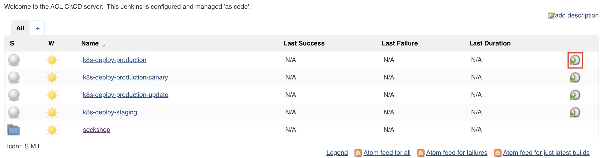

# Deploy to Production

In this lab, we'll promote all components that are currently in the `staging` namespace to the `production` namespace.

## Steps

### Step 1: In your Jenkins instance, trigger the `k8s-deploy-production` pipeline



This pipeline reads the current versions of all artefacts in the `staging` namespace and deploys those artefacts in the exact same version to the `production` namespace. Instead of pushing individual microservices to production, we chose the approach of defining a release bracket, that holds versions of microservices that work together well.

Naturally, we dispatch a deployment event to all affected services. This might not work for the first deployment, because the service might not exist as a Dynatrace entity when dispatching the event, but it will work for all consecutive calls.

### Step 2: Simulation of real-user traffic to front-end service

1. In your Dynatrace tenant, go to **Synthetic** and click on **Create a synthetic monitor**
1. Click on **Create a browser monitor**.
1. Type in the public url of your front-end and give your monitor a name (e.g. Sockshop Monitor).

    ```bash
    (bastion)$ echo http://$(kubectl get svc istio-ingressgateway -n istio-system -o json | jq -r .status.loadBalancer.ingress[].ip)
    ```

1. At *Frequency and locations* set Monitor my website every **5** minutes.
1. Select all Locations and finally click on **Monitor single URL** and **Create browser monitor**.
1. Now, please wait a couple of minutes.

---
[Previous Step: Install Istio](../1_Install_Istio) :arrow_backward: :arrow_forward: [Next Step: Create front-end v2](../3_Create_front-end_v2)

:arrow_up_small: [Back to overview](../)
