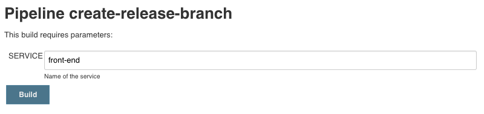
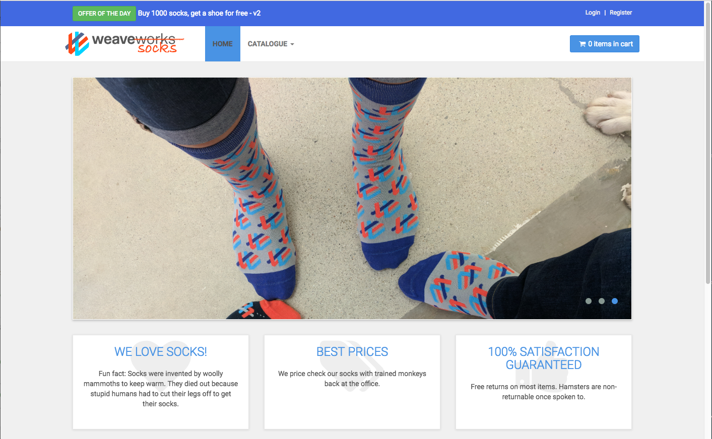

# Create front-end v2

In this lab, we create an improved version of the front-end service. We'll change the color of the header of the application to be able to see the effect of traffic routing between two different artefact versions.

## Steps

1. Edit the file `public/topbar.html` in the master branch of the `front-end` repository and change the following lines:

    ```html
        <!-- *** TOPBAR ***
    _________________________________________________________ -->
    <div id="top">
        <div class="container">
            <!-- add dummy errors -->
            <!-- end dummy errors -->
            <div class="col-md-6 offer" data-animate="fadeInDown">
                <a href="#" class="btn btn-success btn-sm"
                data-animate-hover="shake">Offer of the day</a> <a href="#">Buy 1000 socks, get a shoe for free</a>
            </div>
    ```

- Add a background color and insert V2 into the topbar as shown below:

    ```html
    <!-- *** TOPBAR ***
    _________________________________________________________ -->
    <div id="top" style="background-color:royalblue"> 
        <div class="container">
            <!-- add dummy errors -->
            <!-- end dummy errors -->
            <div class="col-md-6 offer" data-animate="fadeInDown">
                <a href="#" class="btn btn-success btn-sm"
                data-animate-hover="shake">Offer of the day</a> <a href="#">Buy 1000 socks, get a shoe for free - V2</a>
            </div>
    ```

    Save the changes to that file.

1. Now it's time to commit our changes, first locally, and the pushing it to the remote repository.

    ```bash
    (bastion)$ git add .
    (bastion)$ git commit -m "new more colorful version of front-end service"
    (bastion)$ git push
    ```

1. We need the new version of the `front-end` service in the `staging` namespace, before we can start with a blue-green or canary deployment. Therefore, we will create a new release branch in the `front-end` repository using our Jenkins pipeline:

    1. Go to **Jenkins** and **sockshop**.
    1. Click on **create-release-branch** pipeline and **Schedule a build with parameters**.
    1. For the parameter **SERVICE**, enter the name of the service you want to create a release for (**front-end**)

        The pipeline does the following:
        1. Reads the current version of the microservice.
        1. Creates a release branch with the name release/**version**.
        1. Increments the current version by 1. 
        1. Commits/Pushes the new version to the Git repository.




1. After the **create-release-branch** pipeline has finished, we trigger the build pipeline for the `front-end` service and if all goes well, we wait until the new artefacts is deployed to the `staging` namespace.

1. You can now see your changes in the `front-end` service that is deployed in `staging`. Get the public IP of the `front-end` load balancer in `staging` by listing all services in that namespace.

    ```bash
    (bastion)$ kubectl -n staging get services
    NAME           TYPE           CLUSTER-IP      EXTERNAL-IP    PORT(S)
    carts          ClusterIP      10.11.250.175   <none>         80/TCP
    catalogue      ClusterIP      10.11.254.135   <none>         80/TCP
    front-end      LoadBalancer   10.11.249.245   1.2.3.4        8080:31481/TCP
    orders         ClusterIP      10.11.251.11    <none>         80/TCP
    payment        ClusterIP      10.11.248.211   <none>         80/TCP
    queue-master   ClusterIP      10.11.242.139   <none>         80/TCP
    rabbitmq       ClusterIP      10.11.255.201   <none>         5672/TCP,9090/TCP
    shipping       ClusterIP      10.11.244.162   <none>         80/TCP
    user           ClusterIP      10.11.245.147   <none>         80/TCP
    user-db-svc    ClusterIP      10.11.243.25    <none>         27017/TCP
    ```

    Enter the public IP (e.g. 1.2.3.4) in your browser and you should see the awesome visual improvements we did.

    

---

[Previous Step: Deploy to Production](../2_Deploy_to_production) :arrow_backward: :arrow_forward: [Next Step: Deploy front-end v2](../4_Deploy_front-end_v2)

:arrow_up_small: [Back to overview](../)
