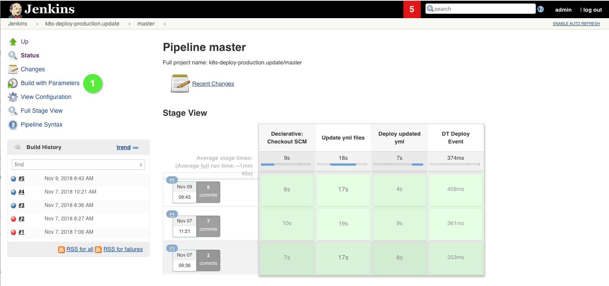
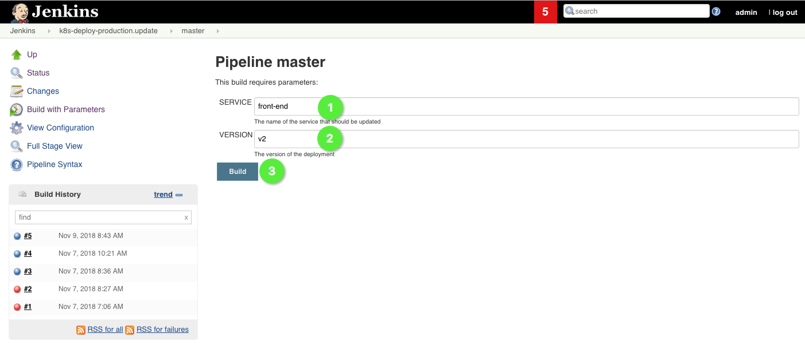

# Deploy front-end v2

In this lab, we'll promote the new version of the `front-end` service to production.

## Steps

1. In your Jenkins instance, trigger the parameterized pipeline `k8s-deploy-production.update` :one:.

    

2. Enter `front-end` as service name and `v2` as new version when asked for parameters to that pipeline.

    

    This pipeline reads the version of the passed service in the `staging` namespace and deploys the artefact in that version to the `production` namespace in a deployment with the passed version number. After running that pipeline, there should be two deployments of `front-end`, one with v1 and one with v2.

    ```bash
    (bastion)$ kubectl -n production get deployment
    NAME           DESIRED   CURRENT   UP-TO-DATE   AVAILABLE   AGE
    ...
    front-end-v1   1         1         1            1           4d
    front-end-v2   1         1         1            1           6d
    ...
    ```

    We've configured the `VirtualService` sockshop to only use v1 initially, so the application is not affected at all by the deployment of a new version in the `production` namespace. You can check the details of the deployments to see that each deployment uses a different artefact version, e.g. `0.4.2` and `0.4.3` in the example below.

    ```bash
    (bastion)$ kubectl -n production describe deployment front-end-v1
    ...
    Pod Template:
    Labels:  app=front-end
            version=v1
    Containers:
    front-end:
        Image:      10.11.249.13:5000/library/sockshop/front-end-0.4.2
        Port:       8080/TCP
        Host Port:  0/TCP
    ...
    (bastion)$ kubectl -n production describe deployment front-end-v2
    ...
    Pod Template:
    Labels:  app=front-end
            version=v2
    Containers:
    front-end:
        Image:      10.11.249.13:5000/library/sockshop/front-end-0.4.3
        Port:       8080/TCP
        Host Port:  0/TCP
    ...
    ```

    Up until now, the new version is deployed successfully to the `production` namespace, but no traffic is routed to the new version. We'll change that in the next step.
---

[Previous Step: Create front-end v2](../3_Create_front-end_v2) :arrow_backward: :arrow_forward: [Next Step: Istio Traffic Routing](../5_Istio_Traffic_Routing)

:arrow_up_small: [Back to overview](../)
