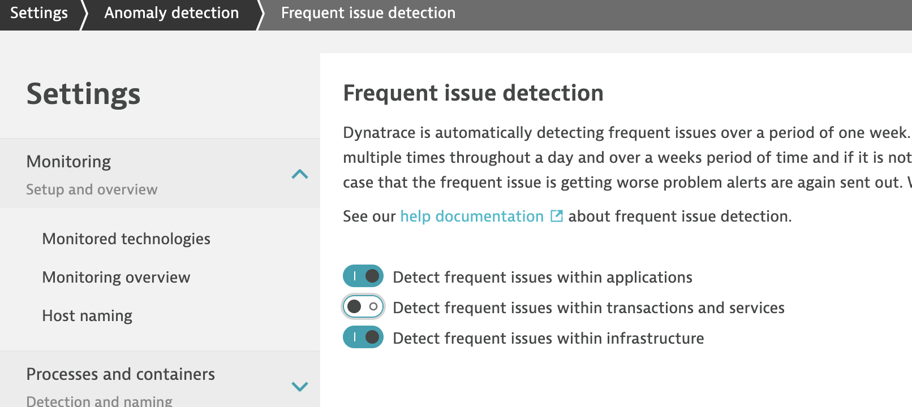

# Check Prerequisites

## Labs

- Monolith to microservices
- Building Environment Zero
- Production Deployments

## Steps

1. To ensure that the same issue detected generates a problem, disable the frequent issue detection toggle:
    - Go to Settings, Anomaly Detection, Frequent issue detection, and click on the button next to Detect frequent issues within transactions and services to disable it.
    - Click on Save Changes



## Troubleshooting

1. If at any point you struggle with having production properly deployed, fixProduction.sh is a script that will recreate production for you. Run fixProduction.sh, and start at the top with the Production Deployments Lab.

Execute with:

```bash
./fixProduction.sh
```

---

:arrow_forward: [Next Step: Deploy Ansible AWX](../01_Deploy_Ansible_AWX)

:arrow_up_small: [Back to overview](../)