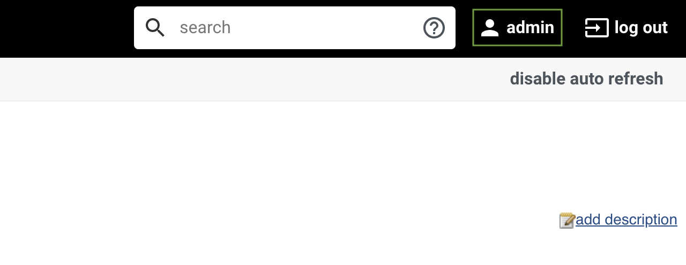
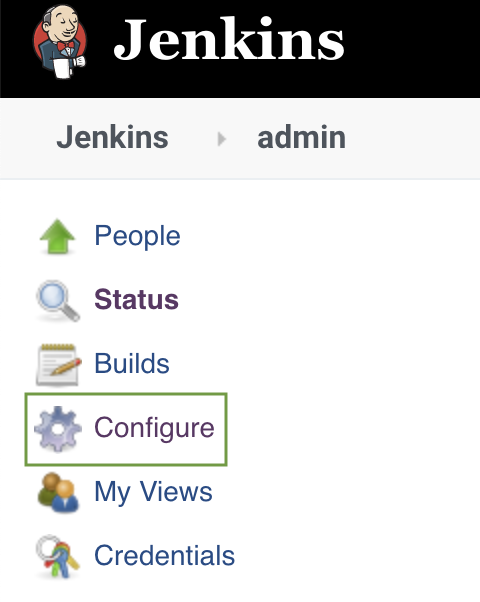
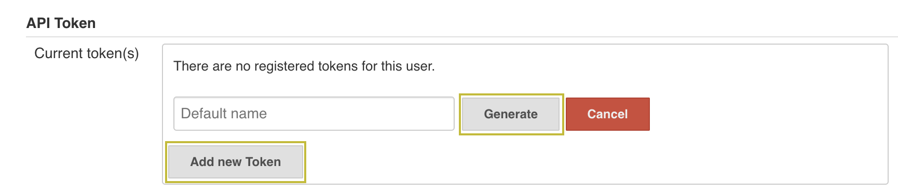
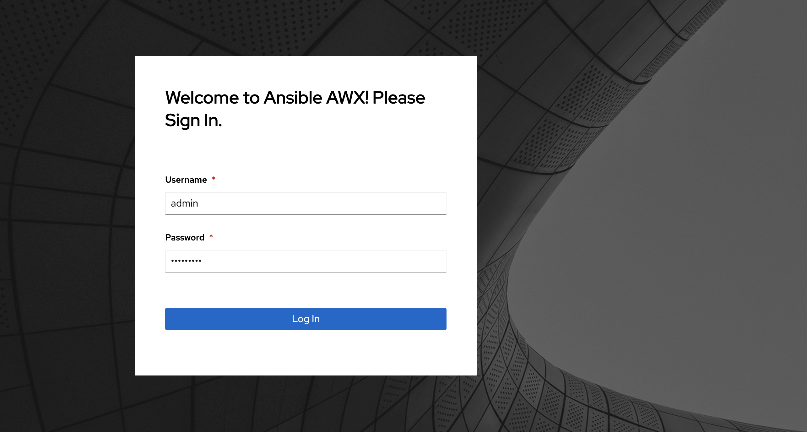
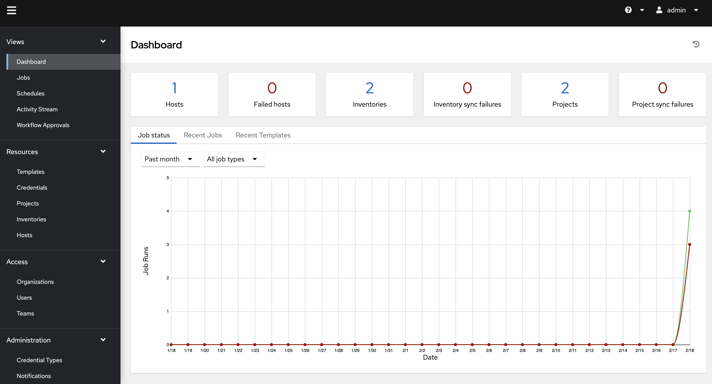

# Deploy ansible AWX

In this lab we are going to deploy [ansible AWX], our chosen tool for automation, inside our cluster. Therefore, you will find a couple of files prepared in your home directory.

## Requirements

* Access to the bastion host
* Access to Jenkins

## Step 1: Configure Jenkins credentials

1. Starting with Jenkins 2.129+, the authentication mechanism for the Jenkins API now uses API tokens which allows a tool, in this case ansible AWX, to impersonate a user without providing the actual password.

1. Click on your username (**admin**) on the top right of the screen:


1. Click on **Configure** on the left side of the screen to access the user profile:


1. Create a Jenkins API token for your user by clicking on **Add new token**, the name and API token will both be autogenerated after you click on **Generate**:


1. Copy the generated token and save it on your preferred notepad.

1. In the bastion host, run the following script to provide the newly generated token to the ansible AWX installer via the creds.json file:

```bash
    (bastion)$ cd
    (bastion)$ ./updateJenkinsPassword.sh
```

## Step 2: Deploy ansible AWX

In order to have this step go faster, an automatic installation option has been provided. This will take the information that was provided earlier and stored in the creds.json file and use that to install and configure ansible AWX.

### Deployment and setup

1. To install and configure ansible AWX automatically, run the script below on the bastion host.

    ```bash
    (bastion)$ cd
    (bastion)$ ./deployAnsibleAWX.sh
    ```

1. This script will create the necessary Kubernetes resources needed for the [ansible AWX] deployment using ansible core and it will also create the configurations needed in order to execute the automated remediation.

1. The script will output the ansible AWX URL that can be then accessed in your browser. Make sure to save the job template URL, as we will use it for our Ansible AWX problem notification in Dynatrace.

    ```bash
    TASK [print remediation template id] *******************************************************************************************************************************************************************************************************************************************
    ok: [localhost] => {
        "msg": "Ansible has been configured successfully! Copy the following URL to set it as an Ansible Job URL in the Dynatrace notification settings: https://awx.XX.XX.XX.XX.nip.io/#/templates/job_template/X"
    }

    PLAY RECAP *********************************************************************************************************************************************************************************************************************************************************************
    localhost                  : ok=14   changed=0    unreachable=0    failed=0    skipped=0    rescued=0    ignored=0   

    ansible AWX login URL: https://awx.XX.XX.XX.XX.nip.io
    ```

1. After the playbook run completes, check the status of the deployment by running `kubectl get pods --namespace awx`

    ```bash
    (bastion)$ kubectl get pods --namespace awx
    NAME                             READY     STATUS    RESTARTS   AGE
    awx-2558692395-2r8ss             4/4       Running   0          29s
    awx-postgresql-355348841-kltkn   1/1       Running   0          1m
    ```

1. Login to ansible AWX with the following credentials:

    * username: `admin`
    * password: `dynatrace`


1. You should see the default Dashboard of ansible AWX:


---

[Previous Step: Check Prerequisites](../00_Check_Prerequisites) :arrow_backward: :arrow_forward: [Next Step: Setup Dynatrace](../02_Setup_Dynatrace)

:arrow_up_small: [Back to overview](../)

[ansible AWX]: https://github.com/ansible/awx