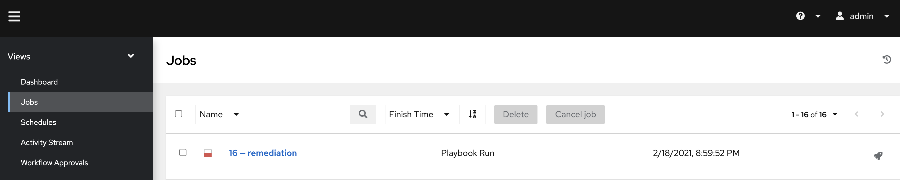

# Integration Ansible AWX jobs in Dynatrace

Let us integration the defined _remediation runbook_ in Dynatrace in a way, that it will be called each time Dynatrace detects a problem. Please note that in a more enterprise scenario, you might want to define _Alerting profiles_ to be able to control in a more fine-grained way when to call a remediation runbook.

## Step 1: Setup a Problem Notification in Dynatrace

1. Navigate to _Settings -> Integration -> Problem notifications_
1. Select `Set up Notifications` and then click `Ansible Tower`.

    
    

1. Enter your Ansible AWX job template URL and Ansible AWX credentials.
    - Name: e.g., "remediation playbook"
    - Ansible AWX job template URL: copy & paste the Ansible AWX job URL from your Ansible AWX remediation job template, e.g., `https://awx.XX.XXX.XX.XXX.nip.io/#/templates/job_template/18`
    - Username: your Ansible AWX username `admin`
    - Password: your Ansible AWX password `dynatrace`
    - Set the alert profile to `Sockshop Error Profile'
    - Click "Send test notification" --> a green banner should appear
    - Save the integration

    

## Step 2: Review Ansible AWX

1. Login (or navigate back) to your ansible AWX instance and check what happenend when setting up the integration.
    - Navigate to _Jobs_ and click on the failed job named `remediation`
    
    - You can see all tasks from the playbook that have been triggered by the integration.

    

## Step 3: Apply anomaly detection rules

Both problem and anomaly detection in Dynatrace leverage AI technology. This means that the AI learns how each and every microservice behaves and baselines them. Therefore, in a demo scenario like we have right now, we have to override the AI engine with user-defined values to allow the creation of problems due to an artificial increase of a failure rate. (Please note if we would have the application running and simulate end-user traffic for a couple of days there would be no need for this step.)

In your Dynatrace tenant, navigate to **Transaction & services** and filter by: `Tag:app:carts` and `Tag:environment:production` 

Click on the **ItemsController** and then on the three dots ( <kbd>...</kbd> ) next to the service name. Click on **Edit**. 

On the next screen, edit the anomaly detection settings as seen in the following screenshot.
    - **Globaly anomaly detection** has to be **turned off**
    - Detect increases in **failure rate** using **fixed thresholds**
    - Alert if **10 %** custom failure rate threshold is exceed during any 5-minute period.
    - Sensitivity: **High**

---

[Previous Step: Deploy Ansible AWX](../01_Deploy_Ansible_AWX) :arrow_backward: :arrow_forward: [Next Step: Trigger Remediation](../03_Trigger_Remediation)

:arrow_up_small: [Back to overview](../)
