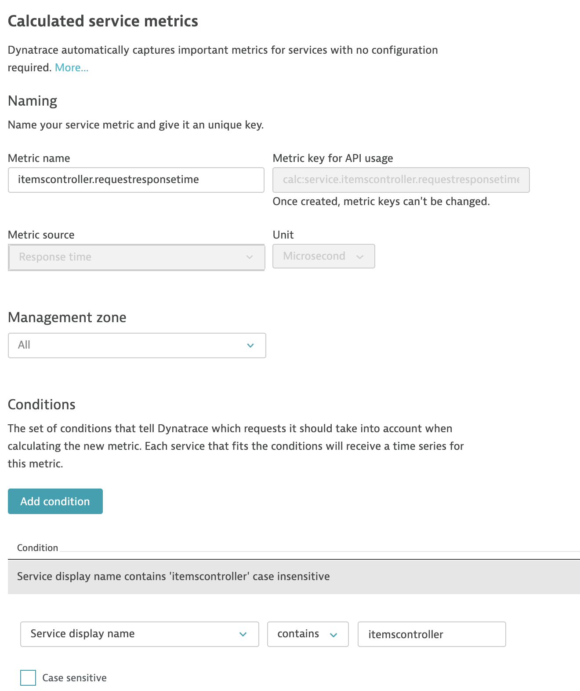
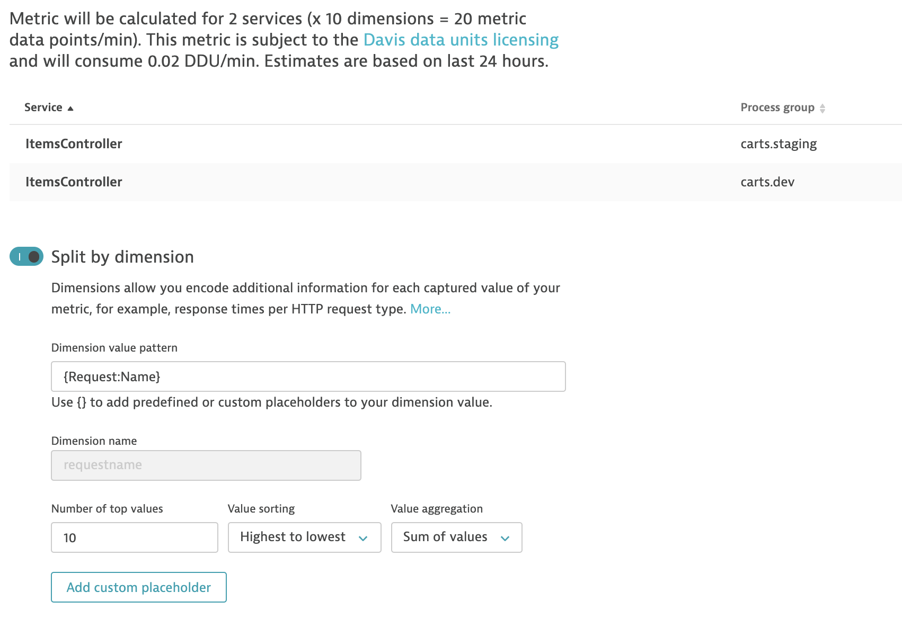

# Harden Staging Pipeline with Quality Gate

In this lab you'll add an additional quality gate to your CI pipeline. In other words, an end-to-end check will verify the functionality of the sockshop application in the staging environment.

## Step 1: Import keptn libraries and set environment variables

1. Uncomment the following lines of code in the Jenkinsfile of `k8s-deploy-staging`:

    ```groovy
    @Library('keptn-library@3.3')
    import sh.keptn.Keptn
    def keptn = new sh.keptn.Keptn()

    environment {
      KEPTN_PROJECT = "acl-sockshop"
      KEPTN_SERVICE = "${APP_NAME}"
      KEPTN_STAGE = "staging"
      KEPTN_MONITORING = "dynatrace"
      KEPTN_SHIPYARD = "keptn/e2e-shipyard.yaml"
      KEPTN_SLI = "keptn/e2e-sli.yaml"
      KEPTN_SLO = "keptn/${APP_NAME}-slo.yaml"
      KEPTN_DT_CONF = "keptn/dynatrace.conf.yaml"
      KEPTN_ENDPOINT = credentials('keptn-endpoint')
      KEPTN_API_TOKEN = credentials('keptn-api-token')
      KEPTN_BRIDGE = credentials('keptn-bridge')
    }
    ```

## Step 2: Add keptn quality gates stages and e2e Test to Staging Pipeline

1. Uncomment the following stages in the Jenkins pipeline of `k8s-deploy-staging`.

    ```groovy
    stage('Keptn Init') {
      steps{
        script {
          keptn.keptnInit project:"${KEPTN_PROJECT}", service:"${KEPTN_SERVICE}", stage:"${KEPTN_STAGE}", monitoring:"${KEPTN_MONITORING}", shipyard: "${KEPTN_SHIPYARD}"
          keptn.keptnAddResources("${KEPTN_SLI}",'dynatrace/sli.yaml')
          keptn.keptnAddResources("${KEPTN_SLO}",'slo.yaml')
          keptn.keptnAddResources("${KEPTN_DT_CONF}",'dynatrace/dynatrace.conf.yaml')          
        }
      }
    } // end stage

    stage('Staging Warm Up') {
      steps {
        echo "Waiting for the service to start..."
        container('kubectl') {
          script {
            def status = waitForDeployment (
              deploymentName: "${env.APP_NAME}",
              environment: 'staging'
            )
            if(status !=0 ){
              currentBuild.result = 'FAILED'
              error "Deployment did not finish before timeout."
            }
          }
        }
        echo "Running one iteration with one VU to warm up service"  
        container('jmeter') {
          script {
            def status = executeJMeter ( 
              scriptName: "jmeter/front-end_e2e_load.jmx",
              resultsDir: "e2eCheck_${env.APP_NAME}_warmup_${env.VERSION}_${BUILD_NUMBER}",
              serverUrl: "front-end.staging", 
              serverPort: 80,
              checkPath: '/health',
              vuCount: 1,
              loopCount: 1,
              LTN: "e2eCheck_${BUILD_NUMBER}_warmup",
              funcValidation: false,
              avgRtValidation: 4000
            )
            if (status != 0) {
              currentBuild.result = 'FAILED'
              error "Warm up round in staging failed."
            }
          }
        }
      }
    } // end stage

    stage('Run production ready e2e check in staging') {
      steps {
        script {
            keptn.markEvaluationStartTime()
        }
        container('jmeter') {
          script {
            def status = executeJMeter ( 
              scriptName: "jmeter/front-end_e2e_load.jmx",
              resultsDir: "e2eCheck_${env.APP_NAME}_staging_${env.VERSION}_${BUILD_NUMBER}",
              serverUrl: "front-end.staging", 
              serverPort: 80,
              checkPath: '/health',
              vuCount: 10,
              loopCount: 5,
              LTN: "e2eCheck_${BUILD_NUMBER}",
              funcValidation: false,
              avgRtValidation: 4000
            )
            if (status != 0) {
              currentBuild.result = 'FAILED'
              error "Production ready e2e check in staging failed."
            }
          }
        }
        script {
          def keptnContext = keptn.sendStartEvaluationEvent starttime:"", endtime:""
          echo "Open Keptns Bridge: ${keptn_bridge}/trace/${keptnContext}"
        }
      }
    } // end stage

    stage('Pipeline Quality Gate') {
      steps {
        script {
          def result = keptn.waitForEvaluationDoneEvent setBuildResult:true, waitTime:'5'
          echo "${result}"
        }
      }
    } // end stage
    ```

## Step 3: Review SLI and SLO definitions

1. Examine the file `keptn/e2e-sli.yaml` outlined below.

    ```yaml
    spec_version: '1.0'
    indicators:
      throughput:                  "metricSelector=builtin:service.requestCount.total:merge(0):sum&entitySelector=tag(environment:$STAGE),tag(app:$SERVICE),type(SERVICE)"
      error_rate:                  "metricSelector=builtin:service.errors.total.count:merge(0):avg&entitySelector=tag(environment:$STAGE),tag(app:$SERVICE),type(SERVICE)"
      response_time_p50:           "metricSelector=builtin:service.response.time:merge(0):percentile(50)&entitySelector=tag(environment:$STAGE),tag(app:$SERVICE),type(SERVICE)"
      response_time_p90:           "metricSelector=builtin:service.response.time:merge(0):percentile(90)&entitySelector=tag(environment:$STAGE),tag(app:$SERVICE),type(SERVICE)"
      response_time_p95:           "metricSelector=builtin:service.response.time:merge(0):percentile(95)&entitySelector=tag(environment:$STAGE),tag(app:$SERVICE),type(SERVICE)"
      response_time_p95_front-end: "metricSelector=builtin:service.response.time:merge(0):percentile(95)&entitySelector=tag(environment:$STAGE),tag(app:front-end),type(SERVICE)"
      rt_addToCart:                "metricSelector=calc:service.itemscontroller.requestresponsetime:filter(eq(requestname,addToCart)):merge(0):percentile(95)&entitySelector=tag(environment:$STAGE),tag(app:$SERVICE),type(SERVICE)"
    ```

1. Examine the file `keptn/carts-slo.yaml` outlined below.

    ```yaml
    ---
    spec_version: "0.1.1"
    comparison:
      aggregate_function: "avg"
      compare_with: "single_result"
      include_result_with_score: "pass"
    filter:
    objectives:
      - sli: "response_time_p95"
        pass:             # pass if (relative change <= 10% AND absolute value is < 400ms)
          - criteria:
              - "<=+10%"  # relative values require a prefixed sign (plus or minus)
              - "<400"    # absolute values only require a logical operator
        warning:          # if the response time is above 400ms and less or equal to 700ms, the result should be a warning
          - criteria:
              - "<=700"  # if the response time is above 700ms, the result should be a failure
      - sli: "response_time_p95_front-end"
        pass:
          - criteria:
              - "<=+10%"
              - "<1400"
        warning:
          - criteria:
              - "<=1500"
      - sli: "error_rate"
        pass:
          - criteria:
              - "<=+5%"
              - "<0.5"
        warning:
          - criteria:
              - "<5"
      - sli: "rt_addToCart" # looking at a particular transaction
        key_sli: true       # business critical transaction
        pass:
          - criteria:
              - "<=+10%"    # Degradation-driven
              - "<300000"   # NFR-driven
        warning:
          - criteria:
              - "<=+50%"
              - "<=500000"
    total_score:
      pass: "90%"
      warning: "75%"
    ```

1. Note the additional sli/slo definition for the `front-end` service. The `staging` environment will be the target for our testing.

## Step 4: Create a calculated service metric for the AddToCart request name

In some cases it is not sufficient to look at the Service level for performance degradations. This is certainly so in large tests that hit many endpoints of a service. This could lead to the results being skewed as very fast responses on one service method could average out the (perhaps fewer in number) slow requests on the degraded service methods.

To remediate this, we will create a calculated service metric that will split the service metric by the `Request Name` dimension.

1. In dynatrace, navigate to `Settings -> Server-side monitoring -> Calculated service metrics`.
1. Click on `Create new metric` set the fields to the following values:
    - **Metric name:** itemscontroller.requestresponsetime
    - **Metric source:** Response time
    - **Unit:** Microsecond
    - **Management zone:** All
    - **Conditions:** `Service display name contains 'itemscontroller' case insensitive`
  
    

    - **Split by dimension:** enabled
    - **Dimension value pattern:** {Request:Name}
    - **Dimension name (case sensitive):** requestname
    - **Number of top values:** 10
    - **Value sorting:** Highest to lowest
    - **Value aggregation:** Sum of values

    

1. The sli and slo for the calculated service metric with id `calc:service.itemscontroller.requestresponsetime` has already been defined on the respective files as shown on [Step 2: Review SLI and SLO definitions](#step-2:-review-sli-and-slo-definitions).

---

:arrow_forward: [Next Step: Simulate Early Pipeline Break](../02_Simulate_Early_Pipeline_Break)