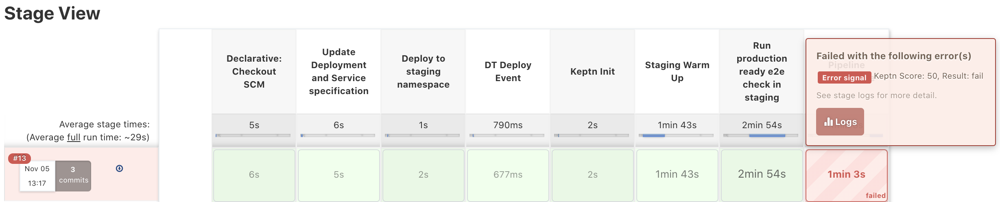

# Simulate Early Pipeline Break

In this lab you'll release a service to staging that is not tested based on performance tests. Intentionally, the service is slowed down to fail at the e2e check in the staging pipeline.

## Step 1: Introduce a Slowdown into the Carts Service

1. Go to the carts repository, make sure you're in the master branch.
1. Open the file: `src\main\resources\application.properties`.
1. Change the value of `delayInMillis` from `0` to `600` and save.
1. Commit/Push the changes to your Gitea Repository *carts*.

## Step 2: Create a new Release

1. Go to **Jenkins** and **sockshop**.
1. Click on **create-release-branch** pipeline and **Schedule a build with parameters**.
1. For the parameter **SERVICE**, the default value `carts` needs to be set as the name of the service we want to create a relase branch for.

    The pipeline does the following:
    1. Reads the current version of the microservice.
    1. Creates a release branch with the name release/**version**.
    1. Increments the current version by 1.
    1. Commits/Pushes the new version to the Git repository.

## Step 3. Build the new Release in Jenkins

1. After the **create-release-branch** pipeline has finished, go to **Jenkins** and **sockshop**.
1. Click on **carts** pipeline and **Scan Multibranch Pipeline Now**.
1. Refresh your browser tab, you should now see the new branch, which triggers the build that deploys `carts`to staging.

## Step 4: Follow the Jenkins Build Pipelines

1. Open the current build by clicking on the **#no**.
1. In the Console Output wait for *Starting building: k8s-deploy-staging* and click on that link.
1. The pipeline should fail due to a response time that exceeds the warning thresholds on the `response_time_p95` and `rt_addToCart` SLIs.

1. Navigate to the keptn bridge URL and examine the latest performance evaluation which should have a `failure` result.

## Step 5: Remove the Slowdown in the Carts Service

1. Go to the carts repository, make sure you're in the master branch.
1. Open the file: `src\main\resources\application.properties`.
1. Change the value of `delayInMillis` from `600` to `0` and save.
1. Commit/Push the changes to your Gitea Repository *carts*.

## Step 6: Create a new Release

1. Go to **Jenkins** and **sockshop**.
1. Click on **create-release-branch** pipeline and **Schedule a build with parameters**.
1. For the parameter **SERVICE**, the default value `carts` needs to be set as the name of the service we want to create a relase branch for.

## Step 7. Build the new Release in Jenkins

1. Go to **Jenkins** and **sockshop**.
1. Click on **carts** pipeline and **Scan Multibranch Pipeline Now**.
1. Refresh your browser tab, you should now see the new branch, which triggers the build that deploys `carts`to staging.

---
[Previous Step: Harden Staging Pipeline with Quality Gate](../01_Harden_Staging_Pipeline_with_Quality_Gate) :arrow_backward: :arrow_forward: [Next Step: Setup Self Healing for Production](../03_Setup_Self_Healing_for_Production)

:arrow_up_small: [Back to overview](../)
