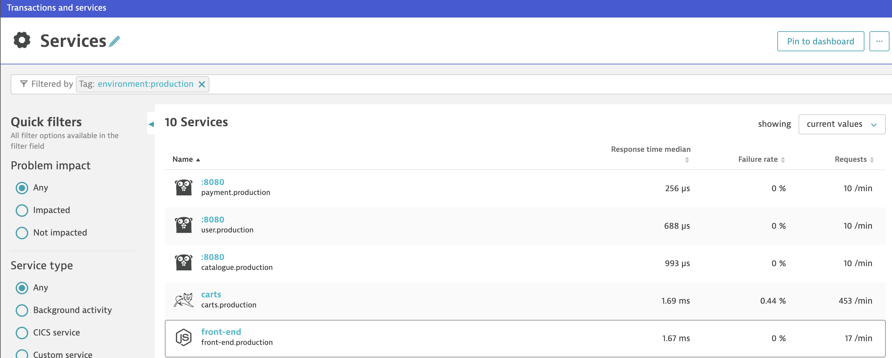
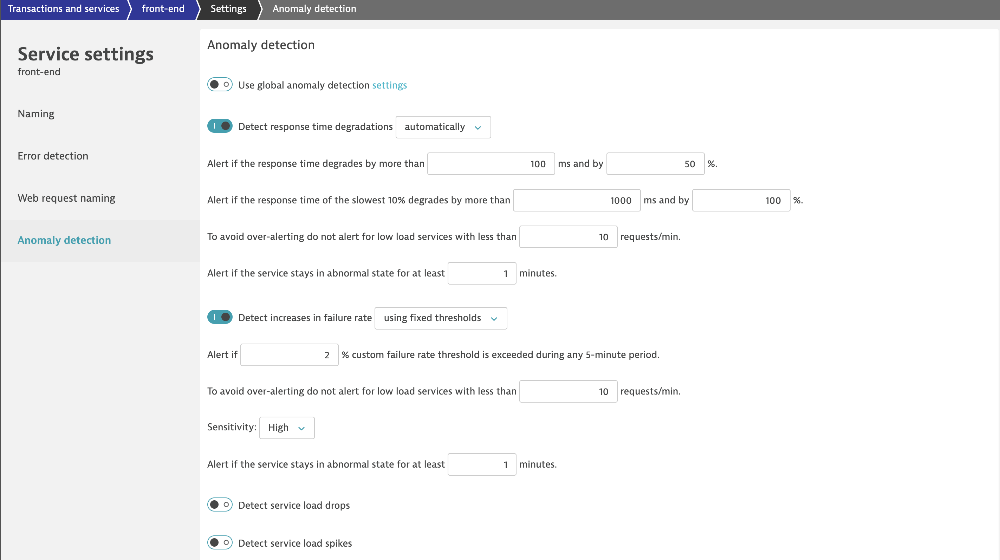
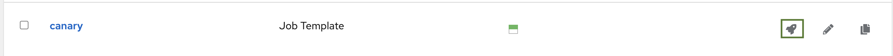
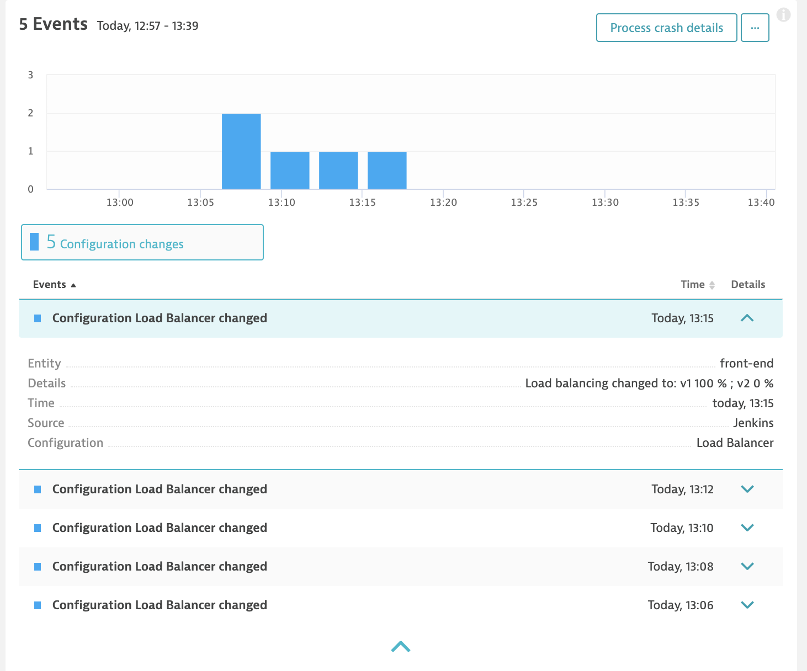
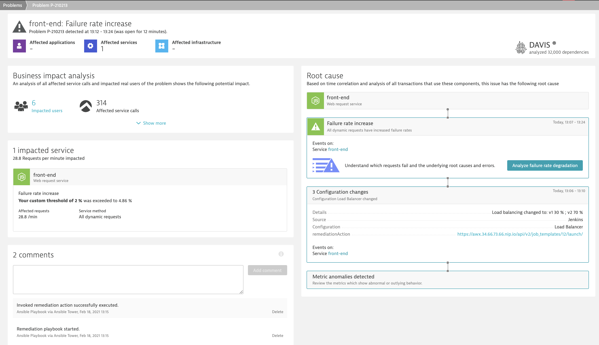

# Simulate a Bad Production Deployment

In this lab you'll create a deployment of the front-end service that passes the quality gate in the staging pipeline and will get deployed to production. Besides, the entire traffic will be be routed to this new version using a prepared deployment pipeline. 
  
## Step 1: Adjust sensitivity of anomaly detection

1. Go to **Transaction & services** and set the filter to `Tag: environment:production`.

1. select the **front-end** service on the production environment.
1. Click on the **...** button in the top right corner and select **Edit**.
1. Go to **Anomaly Detection** and disable the switch for *Use global anomaly detection settings*.
    * In the `Detect increases in failure rate` dropdown, select `using fixed thresholds`.
    * Alert if `2`% custom error rate threshold is exceeded during any 5-minute period.
    * Sensitivity: `High`

1. Go back to the **front-end (production)** service.

## Step 2: Run job template in Ansible AWX

1. Go to ansible AWX.
1. Start the job template **canary** to trigger a canary release of version 2 of the front-end service.

1. The ansible job will gradually shift traffic from the `front-end v1` to the `front-end v2` service.
1. The playbook will also push configuration events to the `front-end (production)` service entity.


## Step 3: Wait for Dynatrace to detect the problem

1. When Dynatrace opens a problem notification, it automatically invokes the remediation action as defined in the canary playbook. In fact, the remediation action refers to the **remediation** playbook, which then triggers the **canary-reset** playbook. Consequently, you see the executed playbooks when navigating to *ansible AWX* and *Jobs*. Moreover, the failure rate of the front-end service must decrease since new traffic is routed to the previous version of front-end.
1. After a successful ansible AWX job execution, Dynatrace will detect the improvement and automatically close the problem.


## (optional) Troubleshooting: If front-end does not show up in Dynatrace

1. Make sure to be in the istio folder in bastion.

    ```bash
    (bastion)$ pwd
    ~/repositories/k8s-deploy-production/istio
    ```

1. Restart the pilot and re-create the virtual service for sockshop.

   ```bash
   (bastion)$ kubectl get pods -n istio-system
   (bastion)$ kubectl delete pod <the name of your istio-pilot> -n istio-system
   (bastion)$ kubectl delete -f ./virtual_service.yml
   (bastion)$ kubectl create -f ./virtual_service.yml
   ```

---
[Previous Step: Setup Self Healing for Production](../03_Setup_Self_Healing_for_Production) :arrow_backward:

:arrow_up_small: [Back to overview](../)
