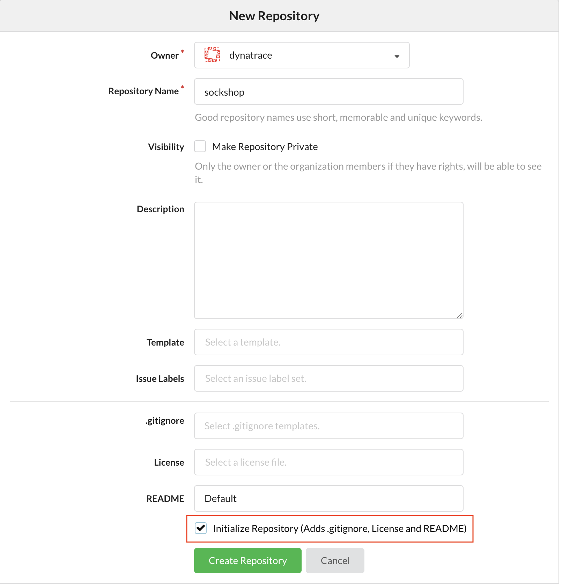
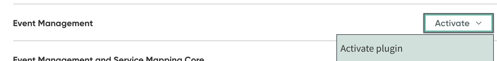
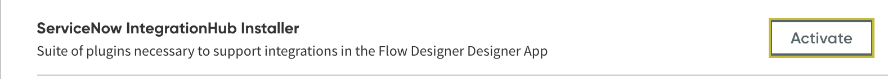

# Preparation for keptn

Before we can install keptn and deploy an application with it, there are a couple of steps we have to take
## Step 1: Delete previous environments
To free up some resources for the next lab we will need to delete our previous namespaces
   ```bash
    (bastion)$ kubectl delete ns dev
    (bastion)$ kubectl delete ns staging
    (bastion)$ kubectl delete ns production
   ```

## Step 2: Create a new Gitea repository in your dynatrace org for keptn

We will need to create a new repo in your Gitea dynatrace org for the project we will create in keptn. The name should be `sockshop`. Make sure to initialize this repo with a README. 


## Step 3: Sign up for a ServiceNow developer Account and request a free dev instance

Go to https://developer.servicenow.com/ and register for a new account.
Once your account has been created and you have signed in to the developer portal, click on `Manage` at the top of the screen. Here you can request your free developer instance.

Sign up for a `Paris` or `Quebec` release instance on the [ServiceNow Developer Portal](https://developer.servicenow.com/)

## Step 4: Activate required ServiceNow plugins

For specific instructions visit [Activate a plugin on a personal developer instance].

The following plugins must be enabled prior to this lab:

- **Event Management plugin** (com.glideapp.itom.snac)

- **ServiceNow IntegrationHub** Installer (com.glide.hub.integrations)


---

:arrow_forward: [Next Step: Reinstall Keptn](../01_Reinstall_keptn)

:arrow_up_small: [Back to overview](../)

[Activate a plugin on a personal developer instance]: https://docs.servicenow.com/bundle/quebec-platform-administration/page/administer/plugins/task/activate-plugin-pdi.html