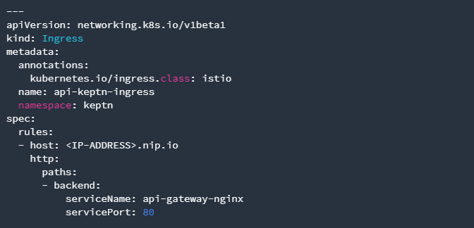
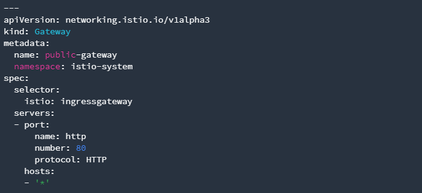

# Configure Istio

In this lab you'll configure Istio to work with Keptn.
We will be using Istio for traffic routing and as an ingress to our cluster. To make the setup experience as smooth as possible we have provided some scripts for your convenience.

## Step 1: Delete the nginx keptn ingress

1. Since we will now switch to using `istio` as our kubernetes service mesh, run the following command to delete the nginx-ingress we created during the [Performance as a self service] lab

    ```bash
    (bastion)$ kubectl delete ingress keptn -n keptn
    ```

## Step 2: Configure Istio

1. Run the istio configuration script hosted on GitHub to create and configure the istio ingress.

    ```bash
    (bastion)$ curl -sL https://raw.githubusercontent.com/keptn/examples/release-0.7.1/istio-configuration/configure-istio.sh | bash
    ```

### What is actually created

With this script, you have created an Ingress based on the following manifest:



Besides, the script has created a gateway resource for you so that the onboarded services are also available publicly:



---

[Previous Step: Reinstall keptn](../01_Reinstall_keptn):arrow_backward::arrow_forward: [Next Step: Configure keptn](../03_Configure_Keptn)

:arrow_up_small: [Back to overview](../)

[Performance as a self service]:../../07_Performance_as_a_Self_Service
