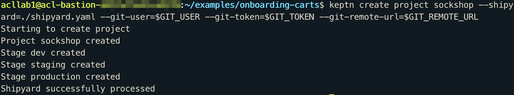
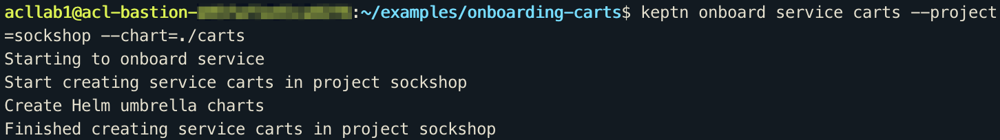
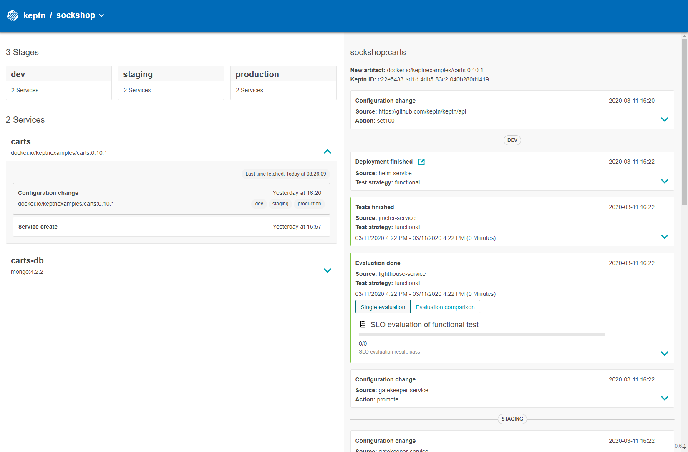
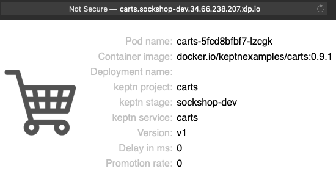
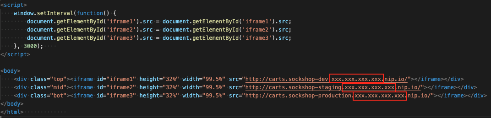

# Onboarding a Service

In this lab you'll onboard a service to keptn

## Step 1: Clone examples repo

Execute the following command from your home directory to clone the keptn examples repo
```
(bastion)$ cd
(bastion)$ git clone --branch release-0.7.2 https://github.com/keptn/examples.git --single-branch
(bastion)$ cd examples/onboarding-carts
```

## Step 2: Create a project

The project will be created using the provided `shipyard` file:

```bash
stages:
- name: "dev"
    deployment_strategy: "direct"
    test_strategy: "functional"
- name: "staging"
    deployment_strategy: "blue_green_service"
    test_strategy: "performance"
- name: "production"
    deployment_strategy: "blue_green_service"
    remediation_strategy: "automated"
```

1. Execute the following commands to set environment variables and creating the project.

    ```bash
    (bastion)$ export GIT_USER=dynatrace
    (bastion)$ export GIT_TOKEN=$(cat ~/creds.json | jq -r '.githubPersonalAccessToken')
    (bastion)$ export GIT_REMOTE_URL=http://$(kubectl -n cicd get ingress gitea-gitea -ojsonpath='{.spec.rules[0].host}')/dynatrace/sockshop.git
    (bastion)$ keptn create project sockshop --shipyard=./shipyard.yaml --git-user=$GIT_USER --git-token=$GIT_TOKEN --git-remote-url=$GIT_REMOTE_URL
    ```

    
2. Go into your gitea repository and verify the results (new branches created, helm charts created).

## Step 3: Onboard services to project


1. Onboard the carts service
    ```bash
    (bastion)$ keptn onboard service carts --project=sockshop --chart=./carts
    ```

    

1. After onboarding the service, a couple of tests (i.e., functional tests and performance tests) need to be added as basis for quality gates in the different stages:
    * Functional tests

        ```bash
        (bastion)$ keptn add-resource --project=sockshop --service=carts --stage=dev --resource=jmeter/basiccheck.jmx --resourceUri=jmeter/basiccheck.jmx
        ```

    * Performance tests

        ```bash
        (bastion)$ keptn add-resource --project=sockshop --service=carts --stage=staging --resource=jmeter/load.jmx --resourceUri=jmeter/load.jmx
        ```

1. Onboard the *carts-db* service using the onboard service command. The `--deployment-strategy` flag specifies that for this service a direct deployment strategy in all stages should be used regardless of the deployment strategy specified in the shipyard. Thus, the database is not blue/green deployed.

    ```bash

    (bastion)$ keptn onboard service carts-db --project=sockshop --chart=./carts-db --deployment-strategy=direct
    ```

1. During the onboarding of the services, Keptn creates a namespace for each stage based on the pattern: `projectname-stagename`.

    ```bash
    (bastion)$ kubectl get namespaces
    NAME                  STATUS   AGE
    ...
    sockshop-dev          Active   2m
    sockshop-production   Active   30s
    sockshop-staging      Active   1m
    ```

## Step 4: Send new artifacts and watch Keptn doing the deployment

1. Deploy the carts-db service by executing the keptn send event new-artifact command:

    ```bash
    (bastion)$ keptn send event new-artifact --project=sockshop --service=carts-db --image=mongo --tag=4.2.2
    ```

1. Deploy the carts service by specifying the built artifact, which is stored on DockerHub and tagged with version 0.11.1.

    ```bash
    (bastion)$ keptn send event new-artifact --project=sockshop --service=carts --image=docker.io/keptnexamples/carts --tag=0.11.1
    ```

## Step 5: Get keptn credentials and Bridge URL

```bash
(bastion)$ cd
(bastion)$ keptn configure bridge --output
(bastion)$ echo http://$(kubectl -n keptn get ingress api-keptn-ingress -ojsonpath='{.spec.rules[0].host}')/bridge
``` 



## Step 6: View the carts service

Get the URL for your carts service with the following commands in the respective namespaces:

```bash
(bastion)$ echo http://carts.sockshop-dev.$(kubectl -n keptn get ingress api-keptn-ingress -ojsonpath='{.spec.rules[0].host}')

(bastion)$ echo http://carts.sockshop-staging.$(kubectl -n keptn get ingress api-keptn-ingress -ojsonpath='{.spec.rules[0].host}')

(bastion)$ echo http://carts.sockshop-production.$(kubectl -n keptn get ingress api-keptn-ingress -ojsonpath='{.spec.rules[0].host}')
```

Navigate to the URLs to inspect the carts service. In the development namespace, you should receive an output similar to this for Dev. Staging and Production will be empty for now.


## Step 7: Prepare the Carts Viewer

Inside this workshop folder you will find a file called `Carts-Viewer.html`.

Download this file to your local machine and open it with your favourite text editor.



On lines `15, 16 and 17`; replace the ip address placeholders (`xxx.xxx.xxx.xxx`) with your keptn endpoint IP and save the file. When you open this file you will be presented with a single view with all namespaces (dev/staging/production) visible.

---

[Previous Step: Configure Keptn](../03_Configure_Keptn) :arrow_backward: :arrow_forward: [Next Step: Quality Gates](../05_Quality_Gates)

:arrow_up_small: [Back to overview](../)
