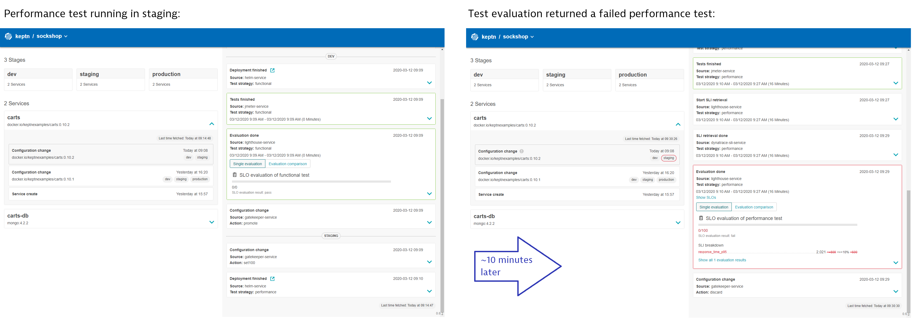

# Quality Gates

In this lab you'll set up automated quality gates using keptn.

## Step 1: Setup quality gate and monitoring

Keptn requires a performance specification for the quality gate. This specification is described in a file called slo.yaml, which specifies a Service Level Objective (SLO) that should be met by a service.

Navigate to the `examples/onboarding-carts` folder and upload the `slo-quality-gates.yaml` file using the add-resource command:

```bash
(bastion)$ cd ~/examples/onboarding-carts
(bastion)$ keptn add-resource --project=sockshop --stage=staging --service=carts --resource=slo-quality-gates.yaml --resourceUri=slo.yaml
```

During the evaluation of a quality gate, an SLI provider is required to fetch the values for the indicators referenced in an SLO configuration.

The `dynatrace-sli-service`, should already be installed on the keptn namespace, you can confirm this by running the following command:

```bash
(bastion)$ kubectl get po -n keptn | grep "dynatrace-sli-service"
```

```bash
NAME                                     READY   STATUS    RESTARTS   AGE
dynatrace-sli-service-755d5f994-pv7t5    2/2     Running   0          62m
``` 

Now configure the SLIs for Dynatrace as specified in `sli-config-dynatrace.yaml`:
```bash
(bastion)$ keptn add-resource --project=sockshop --stage=staging --service=carts --resource=sli-config-dynatrace.yaml --resourceUri=dynatrace/sli.yaml
```
To have keptn use the Dynatrace SLI provider for the project sockshop, execute the following:
```bash
(bastion)$ keptn configure monitoring dynatrace --project=sockshop
```

## Step 2: Open the Carts Viewer Page

In the previous lab ([Onboard Service](../04_Onboard_Service)), we set up a html file that shows all three environments alongside. Open this file. You should only see v1 in the Dev environment.

## Step 3: Deploy the slow carts version

Use the Keptn CLI to deploy a version of the carts service, which contains an artificial slowdown of 1 second in each request.
```bash
(bastion)$ keptn send event new-artifact --project=sockshop --service=carts --image=docker.io/keptnexamples/carts --tag=0.11.2
```

## Step 4: Quality gate in action

After triggering the deployment of the carts service in version v0.11.2, the following status is expected:

* Dev stage: The new version is deployed in the dev namespace and the functional tests passed.
To verify, check the Carts-Viewer.html file for the `dev` stage.
* Staging stage: In this stage, version v0.11.2 will be deployed and the performance test starts to run for about 10 minutes. After the test is completed, Keptn triggers the test evaluation and identifies the slowdown. Consequently, a roll-back to version v0.11.1 in this stage is conducted and the promotion to production is not triggered.
To verify, check the Carts-Viewer.html file for the `staging` stage. The Keptn’s bridge shows the deployment of v0.11.2 and then the failed test in staging including the roll-back:

```bash
(bastion)$ echo http://$(kubectl -n keptn get ingress api-keptn-ingress -ojsonpath='{.spec.rules[0].host}')/bridge
```



* Production stage: The slow version is not promoted to the production namespace because of the active quality gate in place. Thus, still version v0.11.1 is expected to be in production.
To verify, check the Carts-Viewer.html file for the `production` stage.

## Step 5: Deploy a fixed version of carts

Use the Keptn CLI to send a new version of the carts artifact, which does not contain any slowdown.
```bash
(bastion)$ keptn send event new-artifact --project=sockshop --service=carts --image=docker.io/keptnexamples/carts --tag=0.11.3
```
This automatically changes the configuration of the service and automatically triggers the deployment. In this case, the quality gate is passed and the service gets deployed in the production namespace. To verify, check the Carts-Viewer.html file for the `production` stage. As a result, you see `Version: v3`.

Alternatively, you can verify the deployments in your Kubernetes cluster using the following commands:

```bash
(bastion)$ kubectl get deployments -n sockshop-production
NAME            DESIRED   CURRENT   UP-TO-DATE   AVAILABLE   AGE
carts-db        1         1         1            1           63m
carts-primary   1         1         1            1           98m

(bastion)$ kubectl describe deployment carts-primary -n sockshop-production

...
Pod Template:
  Labels:  app=carts-primary
  Containers:
    carts:
      Image:      docker.io/keptnexamples/carts:0.11.3
```

---

[Previous Step: Onboard a Service](../04_Onboard_Service) :arrow_backward: :arrow_forward: [Next Step: Self Healing](../06_Self_Healing)

:arrow_up_small: [Back to overview](../)
