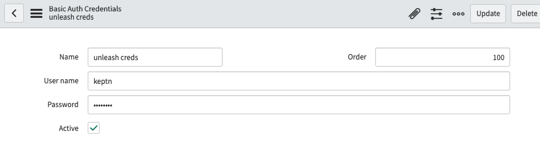
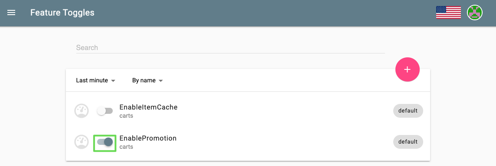

# Runbook Automation

Gives an overview of how to leverage the power of runbook automation to build self-healing applications. This tutorial uses ServiceNow subflows that trigger when open problem events from keptn are generated.

## About this tutorial

Configuration changes during runtime are sometimes necessary to increase flexibility. A prominent example are feature flags that can be toggled also in a production environment. In this tutorial, we will change the promotion rate of a shopping cart service, which means that a defined percentage of interactions with the shopping cart will add promotional items (e.g., small gifts) to the shopping carts of our customers. However, we will experience issues with this configuration change. Therefore, we will set logic in place that is capable of auto-remediating issues at runtime via ServiceNow subflows.

## Prerequisites

- Finish the [Onboarding a Service] lab.
- ServiceNow instance or free ServiceNow [developer instance].
- [Configure Monitoring] lab.
- [Self Healing] lab.

## Remove previous keptn remediation configurations

If the [Self-healing] lab was successfully completed, all the remediation files added as resources to the sockshop project in the production stage, will need to be deleted either from the Git upstream or locally.

1. Disable the keptn built-in remediation by running the following commands from the home directory:

    ```bash
    (bastion):$ cd
    (bastion):$ echo "" > disable_keptn_remediation.yaml
    (bastion):$ keptn add-resource --project=sockshop --service=carts --stage=production --resource=disable_keptn_remediation.yaml --resourceUri=remediation.yaml
    ```

## Create ServiceNow secret

Create a ServiceNow kubernetes secret to allow the ServiceNow keptn service to create events and update alerts in ServiceNow and trigger subflows.

1. Create a file as shown below that contains your ServiceNow credentials and save it in your current directory as cred_file.yaml:

    ```bash
    SERVICENOW_INSTANCE: {instance_id}.service-now.com
    SERVICENOW_USER: your_servicenow_user
    SERVICENOW_PASSWORD: your_servicenow_password
    ```

    **Note:** The ServiceNow user needs to have the evt_mgmt_integration or admin role(s) assigned to it.

1. Run the command below to create the ServiceNow secret:

    ```bash
    (bastion):$ kubectl create secret generic servicenow -n keptn --from-file=servicenow-credentials=cred_file.yaml
    ```

## Install the ServiceNow service on the keptn namespace

1. Subscribe the servicenow-service to keptn sh.keptn.event.problem.open events by applying the distributor manifest and deploy the servicenow-service by running the following command:

    ```bash
    (bastion):$ kubectl -n keptn apply -f https://raw.githubusercontent.com/keptn-contrib/servicenow-service/release-0.2.1/deploy/service.yaml
    ```

After running this command, the servicenow-service and distributor are now deployed in your cluster. Execute the following commands to verify the deployment of the servicenow-service.

```bash
(bastion):$ kubectl get svc servicenow-service -n keptn
```

```bash
NAME                 TYPE        CLUSTER-IP      EXTERNAL-IP   PORT(S)    AGE
servicenow-service   ClusterIP   10.51.246.134   <none>        8080/TCP   18m
```

```bash
(bastion):$ kubectl get po -n keptn | grep "servicenow"
```

```bash
NAME                                                              READY   STATUS    RESTARTS   AGE
servicenow-service-5b67cc545c-c2452                               2/2     Running   0          17m
```

## Create unleash credential and connection in ServiceNow

For ServiceNow to be able to connect to the Unleash server, we have to add create the required credentials and since ServiceNow is running externally, we'll need to provide the connection details.

### Create unleash credential

1. On your ServiceNow instance, navigate to **Connections and Credentials -> Credentials**.
1. Click one **New**, select **Basic Auth Credentials** and set the fields as follows:
    - Name: unleash creds
    - Username: keptn
    - Password: keptn
1. Click on Submit


### Create unleash connection alias

1. On your ServiceNow instance, navigate to **Connections and Credentials -> Connection & Credential Aliases**.
1. Click on **New** and set the fields as follows:
    - Name: unleash
    - Type: Connection and Credential
    - Connection Type: HTTP
    - Default Retry Policy: Default HTTP Retry Policy

1. Right click on the form header and select save.
1. Retrieve the unleash URL:

    ```bash 
    (bastion)$ echo http://unleash.unleash-dev.$(kubectl -n keptn get ingress api-keptn-ingress -ojsonpath='{.spec.rules[0].host}')
    ```

1. Under connections, click on new.
1. Fill out the HTTP(s) Connection form with the following values:
    - Name: unleash connection
    - Credential: unleash creds
    - Connection alias: unleash
    - Connection URL: `http://unleash.unleash-dev.XXX.XXX.XXX.XXX.nip.io`
1. Click on submit


## Configure ServiceNow for automated remediation

A ServiceNow Update Set is provided to run this tutorial. To install the Update Set follow these steps:

1. Login to your ServiceNow instance.
1. Type `update set` in the left filter navigator and go to **System Update Sets -> Update sets to Commit**

    

1. Click on Import Update Set from XML

1. Download the update set xml file [keptn-remediation-1.1.xml].

1. Import and Upload the file [keptn-remediation-1.1.xml] file.

1. Open the Update Set

    

1. In the right upper corner, click on Preview Update Set and once previewed, click on Commit Update Set to add the required configurations required for this tutorial to your instance.

    

    **Note:** The update set will add an alert management rule named `keptn - Create incident and run remediation subflow` and a subflow: `keptn auto-remediate service failure rate` to your instance on the global application scope.

1. Navigate to `Integration Hub` -> `Action Designer` and search for the action `keptn disable feature toggle`

    

1. Open the action by clicking on its name.

1. Lastly on the action editor, click on the REST step and set the Connection alias to `unleash` and proceed to then click on **Save** and **Publish**

    

## Run the tutorial

Now all the pieces are in place to run the use case of a problem found in production. Therefore, we will start by generating some load on the carts service in our production environment. Afterwards, we will change the configuration of this service at runtime. This will cause an increase in failures in the carts service running in our production environment, dynatrace will detect the issue and using the custom problem notification we set up in Dynatrace, keptn will be informed about the problem and will forward it to the servicenow-service that in turn creates an alert in ServiceNow. This alert will trigger a subflow from the configured alert management rule that is able to remediate the issue at runtime.

### Simulate user traffic

To simulate user traffic, we are going to execute the following script that will constantly add items to the shopping cart.

1. Change into the folder with the load generation program within the examples repo:

    ```bash
    (bastion)$ cd ~/examples/load-generation/bin
    ```

1. Start the according load generation program depending on your operating system (replace *OS with either linux, mac or win):

    ```bash
    (bastion)$ ./loadgenerator-linux http://carts.sockshop-production.$(kubectl -n keptn get ingress api-keptn-ingress -ojsonpath='{.spec.rules[0].host}')
    ```

1. Now, go back to your Unleash server in your browser. In this tutorial, we are going to turn on the promotional campaign, which purpose is to add promotional gifts to about 30 % of the user interactions that put items in their shopping cart.

1. Click on the toggle next to EnablePromotion to enable this feature flag.

    

1. By enabling this feature flag, a not implemented function is called resulting in a NotImplementedFunction error in the source code and a failed response. After a couple of minutes, dynatrace will detect an increase in the failure rate and will send out a problem notification to Keptn.

## Problem detection by Dynatrace

Navigate to the ItemsController service by clicking on Transactions & services and look for your ItemsController. Since our service is running in three different environment (dev, staging, and production) it is recommended to filter by the `keptn_stage:production` to make sure to find the correct service.


After a couple of minutes, Dynatrace will open a problem ticket based on the increase of the failure rate.


## Alert/Incident Generation & subflow execution by ServiceNow

The keptn problem notification configured in Dynatrace is sent out to keptn where the ServiceNow service is subscribed to open problem events. Thus, the ServiceNow service takes the event and creates a new alert in ServiceNow. In your ServiceNow instance, you can take a look at all alerts by navigating to **Event Management -> All alerts**. You should be able to see the newly created alert, click on it to view some details.


Other useful unformation can be found on the lower portion of the alert such as the additional information field, Alert Executions and Remediation Tasks.


Review the lifecycle of the alert


Finally, take a look into the Keptn’s Bridge to see that an open problem has been resolved:
    

## Troubleshooting

- Please note that Dynatrace has a feature called Frequent Issue Detection enabled by default. This means, that if Dynatrace detects the same problem multiple times, it will be classified as a frequent issue and problem notifications won’t be sent out to third party tools. Therefore, the tutorial might not be able to be run a couple of times in a row. To disable this feature:

1. Login to your Dynatrace tenant.
1. Navigate to Settings > Anomaly detection > Frequent issue detection
1. Toggle the switch at Detect frequent issues within transaction and services

- To view the logs of the servicenow-service pod, you can run the following commands:

```bash
(bastion):$ kubectl logs -l 'run=servicenow-service' -c servicenow-service -n keptn
```

```
{"result":{"Default Bulk Endpoint":"1 events were inserted"}}
{"result":{"Default Bulk Endpoint":"1 events were inserted"}}
{"timestamp":"2020-01-31T00:59:58.826021749Z","logLevel":"ERROR","message":"Received unexpected keptn event"}
{"level":"warn","ts":1580432398.8261862,"logger":"fallback","caller":"http/transport.go:337","msg":"got an error from receiver fn: %s","error":"Received unexpected keptn event"}
{"level":"warn","ts":1580432398.8262806,"logger":"fallback","caller":"http/transport.go:421","msg":"error returned from invokeReceiver","error":"Received unexpected keptn event"}
{"result":{"Default Bulk Endpoint":"1 events were inserted"}}
```

In ServiceNow you can look at the subflow execution directly from the Alert exetutions tab on the alert record and reviewing at the subflow statistics for further troubleshooting.

In case Dynatrace detected a problem before the ServiceNow secret was created in your Kubernetes cluster, the remediation will not work. Resolution:

1. Create the secret.
1. Restart the pod.

```bash
(bastion):$ kubectl delete pod -l 'run=servicenow-service' -n keptn
```

[Previous Step: Self-Healing](../06_Self_Healing) :arrow_backward:

:arrow_up_small: [Back to overview](../)

[Onboarding a Service]: ../03_Onboard_Service/README.md
[Configure monitoring]: ../02_Configure_Monitoring/README.md
[Self Healing]: ../05_Onboard_Service/README.md
[Activate a plugin on a personal developer instance
]: https://docs.servicenow.com/bundle/paris-platform-administration/page/administer/plugins/task/activate-plugin-pdi.html
[Self-healing]: ../05_Self-Healing/README.md
[keptn-remediation-1.1.xml]: ../assets/keptn-remediation-1.1.xml
[Configure Monitoring]: ../02_Configure_Monitoring/README.md
[Developer Portal]: https://developer.servicenow.com/
[keptn_remediation_1.0.xml]: ./keptn_remediation_1.0.xml
[developer instance]: https://developer.servicenow.com/
